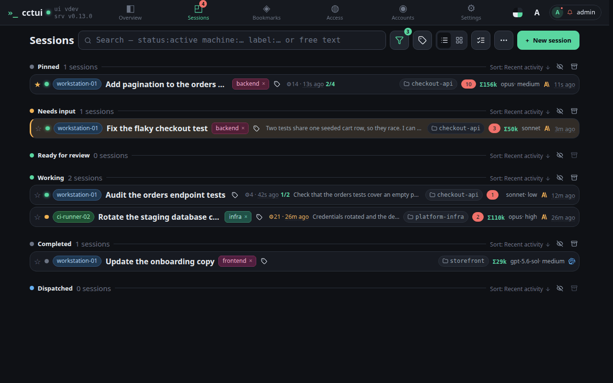
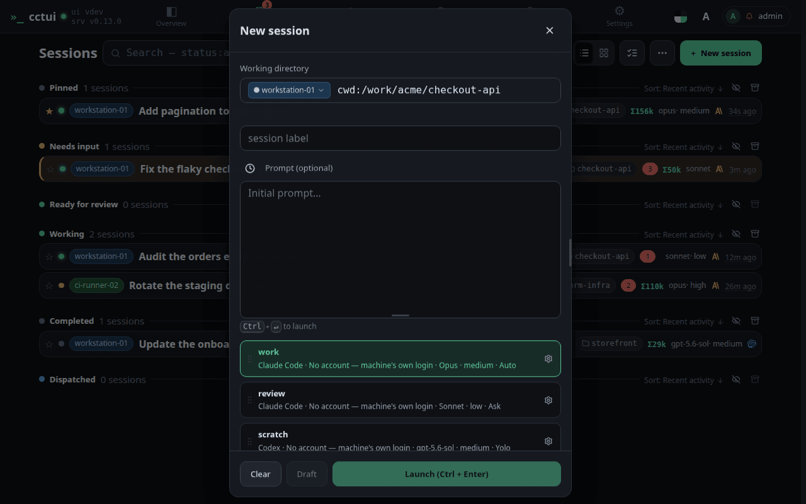
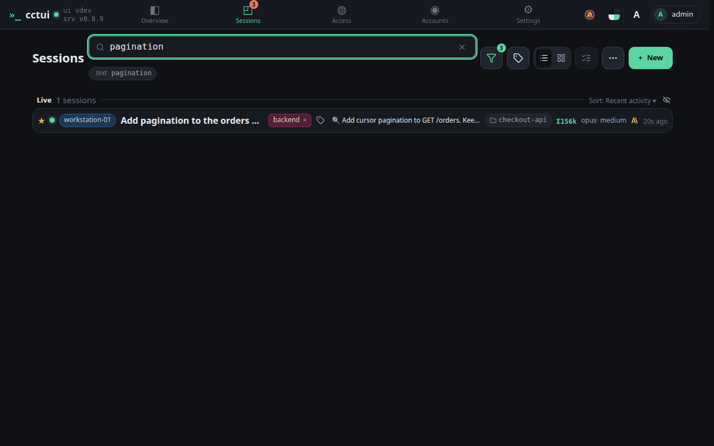
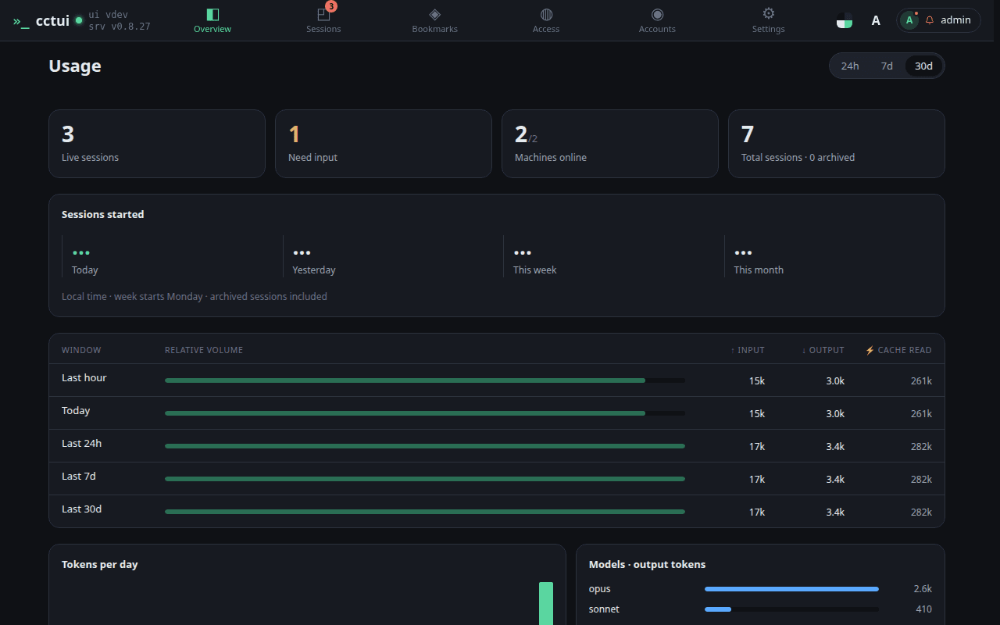
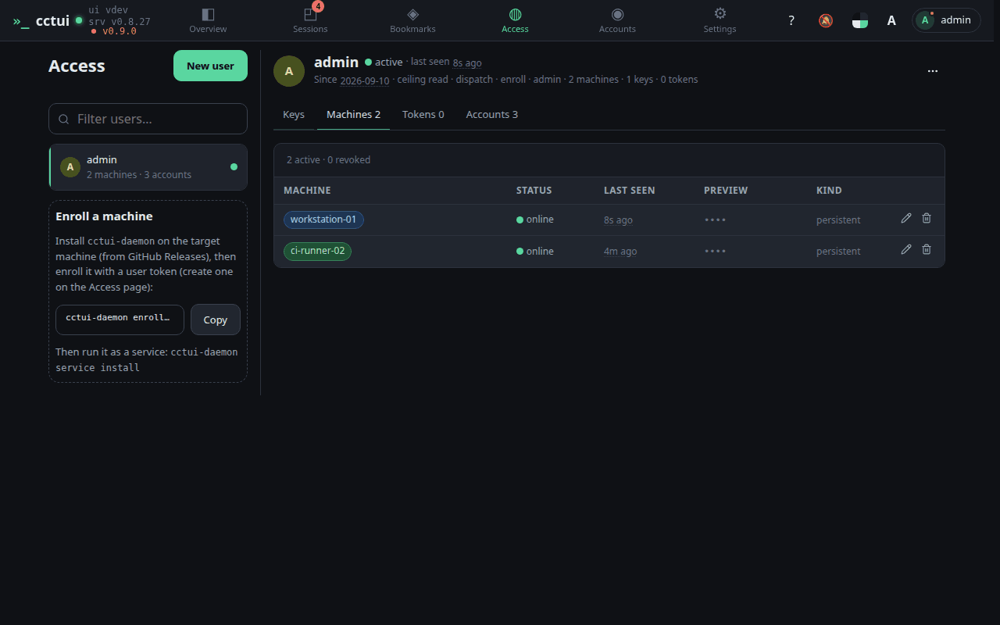
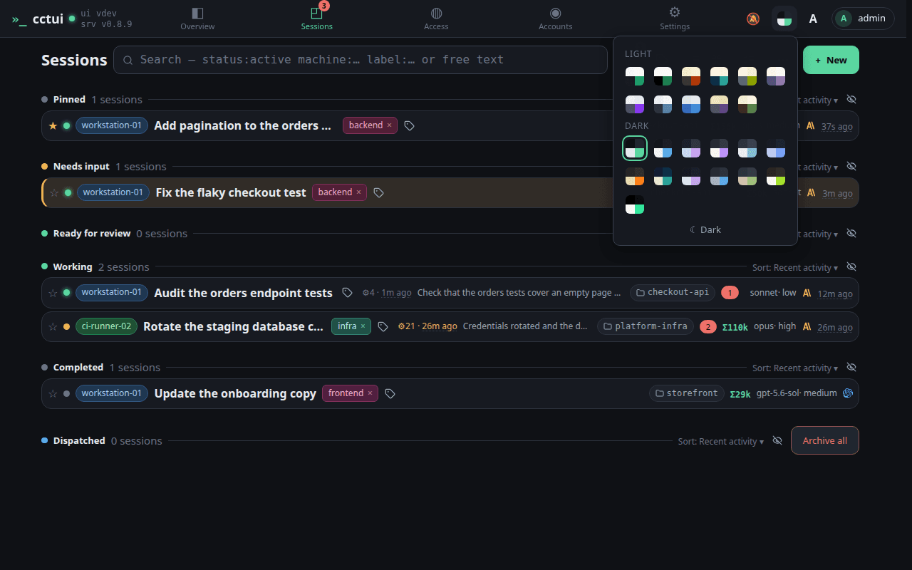

# cctui

Web control plane for monitoring and driving Claude Code (and Codex) sessions across machines.

Watch conversations in real time, send input to running sessions, answer permission and interactive prompts, and spawn or dispatch agents on any enrolled machine — all from a single web UI.

> [!WARNING]
> cctui is an early-stage personal project under active development. Expect
> breaking changes, rough edges, and incomplete features. It is not stable and
> not yet recommended for production use.

## Architecture

```
                  cctui-daemon  <-->  Claude Code / Codex sessions
                       ^
cctui-server (Axum, PostgreSQL)  <-->  web UI
                       |
                  dispatchers  -->  ephemeral k8s worker pods
```

- **cctui-server** — Session registry, event store, full-text search, WebSocket hub, and REST API (`/api/v1`). Also serves the daemon-binary manifest used for self-updates.
- **cctui-daemon** — Long-lived per-machine daemon. Enrolls with the server, connects out over WebSocket, and spawns/observes local agent sessions through pluggable adapters (Claude Code, Codex). Self-updates from GitHub Releases.
- **web UI** — SvelteKit SPA (`webui/`): overview, live session view, spawn/dispatch, search & archive, and user/machine management.
- **cctui-admin** — CLI for managing users, machines, and archived sessions.

A terminal UI crate (`cctui-tui`) also exists but is currently work-in-progress.

## Features

- **Live session view** — Real-time conversation stream (text, tool calls, results) with markdown rendering, search-term highlighting, and a composer to reply to running agents.
- **Permission & interactive prompts** — Approve/deny tool-permission requests inline, toggle auto-approve, set per-session policies, and answer structured `AskUserQuestion` prompts as real forms.
- **Spawn & dispatch** — Start a session on any enrolled daemon (pick adapter, working dir, prompt, permission mode), or dispatch work to ephemeral Kubernetes worker pods.
- **Search & archive** — Full-text search across session transcripts (live and archived), with multi-select batch archiving and resume.
- **Multi-machine** — Enroll any number of machines; sessions, liveness, and token usage roll up into one view.
- **Adapter-agnostic** — Claude Code and Codex events normalize to a single canonical shape, so the UI has one renderer.

### See it

Every screen below is captured from a running instance on a synthetic fixture,
and re-captured whenever the UI moves. The same flows are recorded at phone
width and in other themes: **[docs/journeys.md](docs/journeys.md)**.

**Read the fleet at a glance** — sessions grouped by what they need from you.



**Follow a session while it works** — the transcript, its tool calls, and a composer that reaches the running agent.


**Start a new agent** — pick the machine and folder, write the brief, or park it as a draft.



**Find a session again** — free text searches the transcripts; `label:`, `machine:` and `status:` narrow the list.



**See what the fleet is costing** — live counts, token windows and a per-model breakdown.



**Bring a machine into the fleet** — users, keys, one enrolment command, and machine liveness.



**Twenty-one themes** — light and dark, applied to every screen.



## Enrolling a machine

Install `cctui-daemon` on the target host (download the matching binary from GitHub Releases), then enroll it with a user token:

```sh
cctui-daemon enroll --server-url https://your-cctui-server --token <user-token> --name "$(hostname)"
cctui-daemon service install   # run it as a systemd user service
```

Create user tokens from the web UI's Users page (or with `cctui-admin`). Once
enrolled, the daemon connects to the server and the machine's sessions show up
in the UI. cctui does **not** modify your Claude Code configuration — the daemon
observes and spawns sessions directly.

## Run cctui locally

The quickest way to try cctui — no source build. A self-contained Docker Compose
stack pulls the published images (server + web UI) plus PostgreSQL, fully wired.
Works on Linux and macOS.

```sh
make local/up      # pulls ghcr images + postgres, starts the stack
```

- **Web UI** → http://localhost:8088 (log in with the admin token `dev-admin`)
- **Server API** → http://localhost:8700

The server migrates its database on start; nothing else to set up. Other targets:
`make local/pull` (update images), `make local/logs`, `make local/ps`,
`make local/down`. Configuration (ports, tokens, image tags) lives in
[`deploy/local/docker-compose.yaml`](deploy/local/docker-compose.yaml) — override
via env vars (`CCTUI_ADMIN_TOKENS`, `CCTUI_UI_PORT`, …).

### Connect a machine

The **daemon is not containerised** — it runs on your host so it can see your real
`claude`/`codex` binaries and working directories. Download `cctui-daemon` from
[Releases](https://github.com/DorskFR/cctui/releases), then enroll it against the
local server (use the admin token, or a user token created from the UI's Users page):

```sh
cctui-daemon enroll --server-url http://localhost:8700 --token dev-admin --name "$(hostname)"
cctui-daemon service install   # run it as a systemd user service (Linux)
```

The machine and its sessions then show up in the UI.

## Local development

Prerequisites: Rust (nightly for fmt), Docker, PostgreSQL.

```sh
make setup          # start postgres, migrate, build
make run/server     # server on :8700
```

```sh
make webui/install  # bun install
make webui/dev      # Vite dev server
```

Default dev tokens are in the Makefile.

## License

[MIT](LICENSE)
