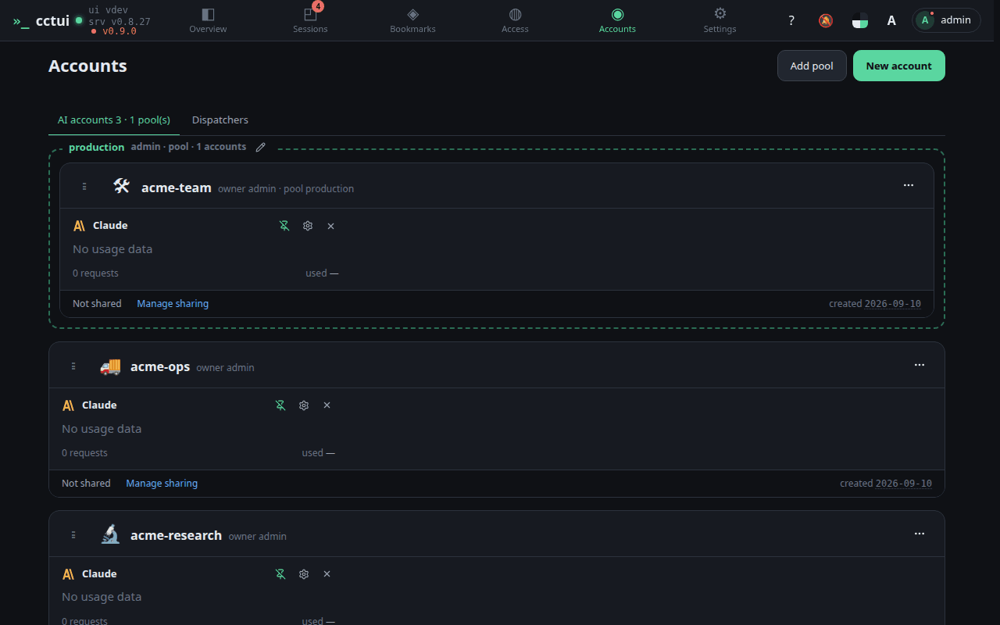
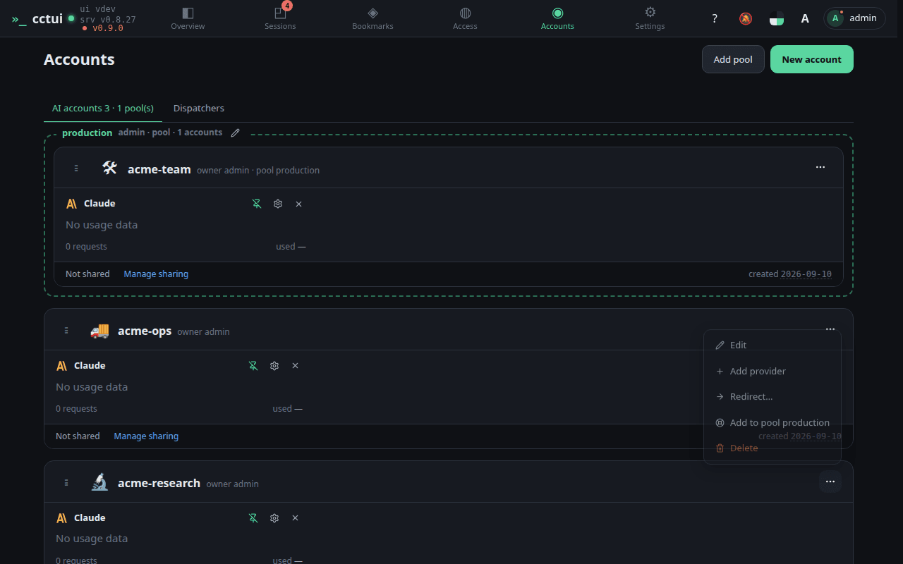

# Connect a provider account

## viewport=desktop theme=dark

**Every account you can run on**

Accounts are the provider credentials your agents run on. This board is empty until you add one.

**A pool is a set of interchangeable accounts**

Launches aimed at the pool elect a member by headroom, so a spent weekly budget on one account does not stop the work.

**Drag an account into a pool**

The grip on a card lifts it; dropping it on a pool adds it to the membership.

**Or add it from the card menu**

The same membership change without a mouse drag, which is also how it is done on a phone.

## viewport=mobile theme=dark

**Every account you can run on**

Accounts are the provider credentials your agents run on. This board is empty until you add one.

**A pool is a set of interchangeable accounts**

Launches aimed at the pool elect a member by headroom, so a spent weekly budget on one account does not stop the work.

**Drag an account into a pool**

The grip on a card lifts it; dropping it on a pool adds it to the membership.

**Or add it from the card menu**

The same membership change without a mouse drag, which is also how it is done on a phone.
