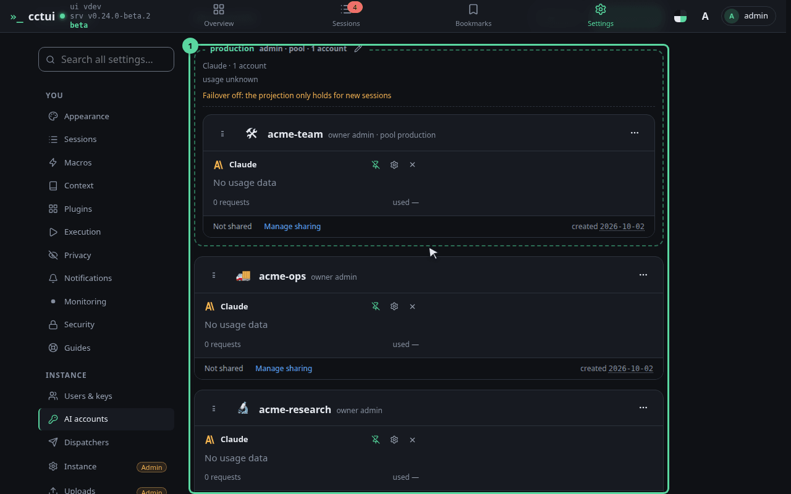
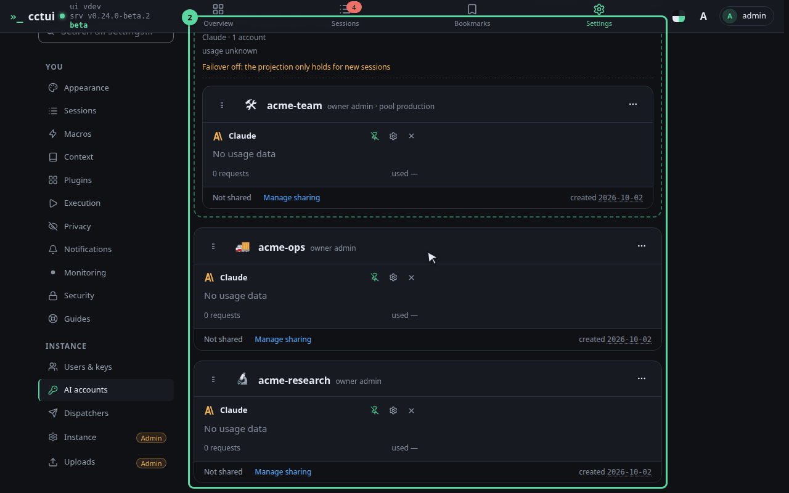
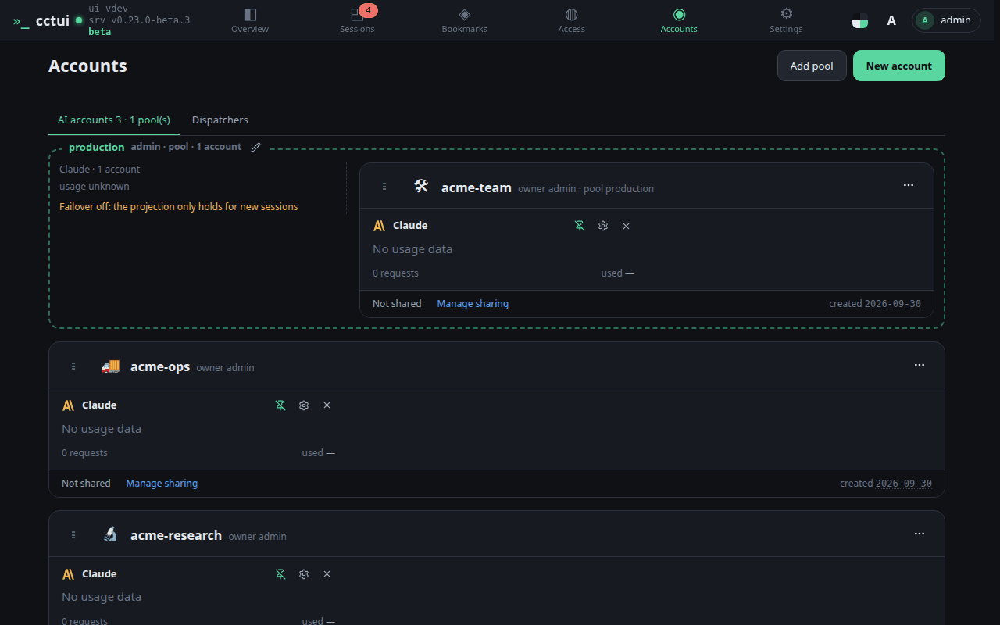
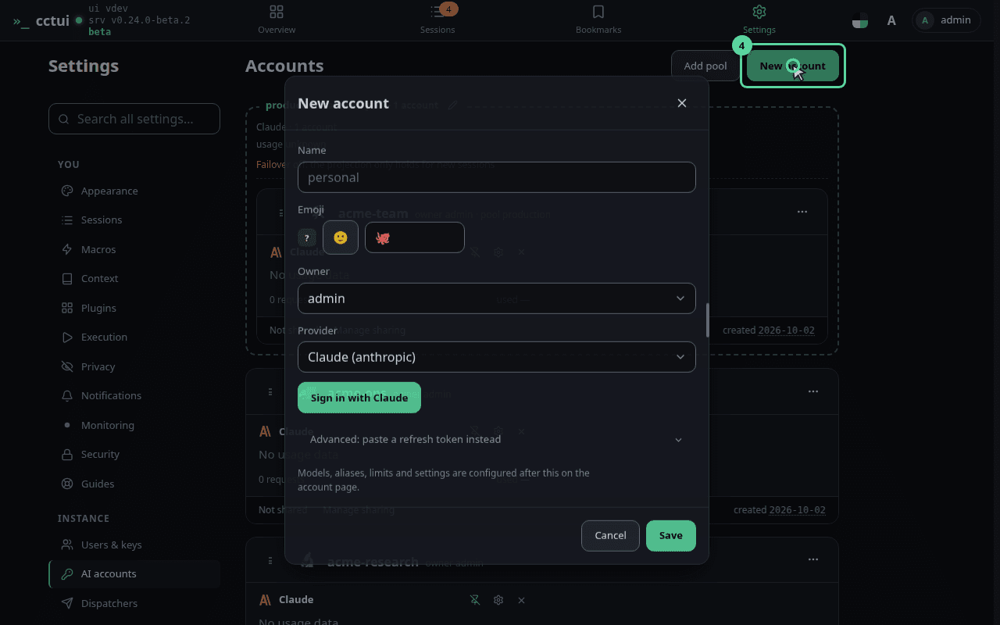
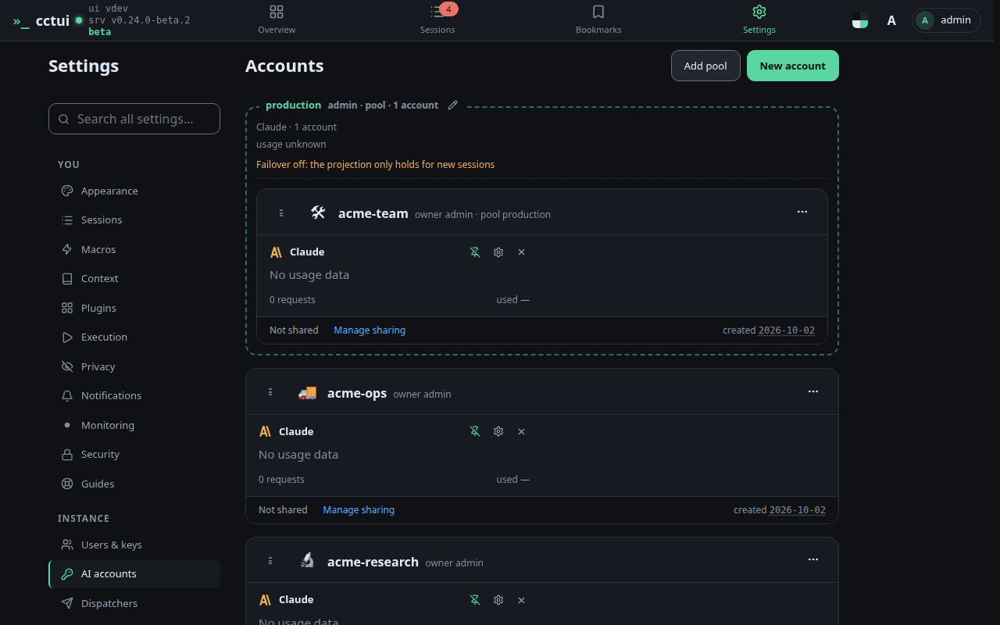
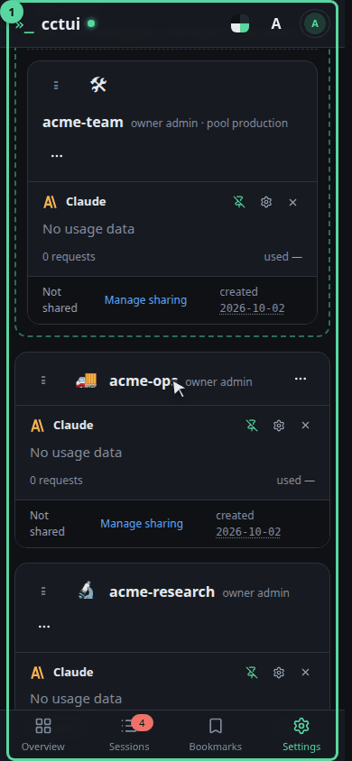
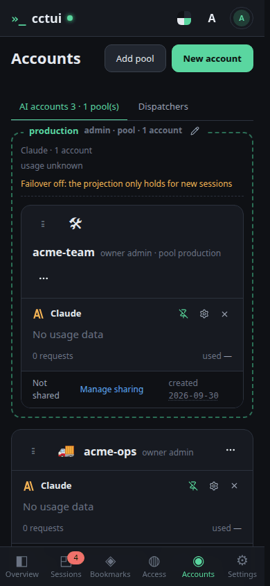
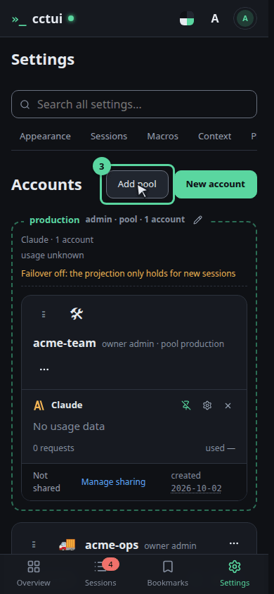
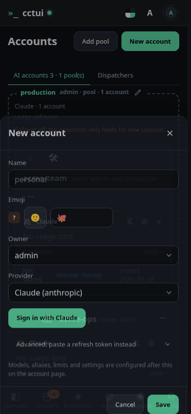
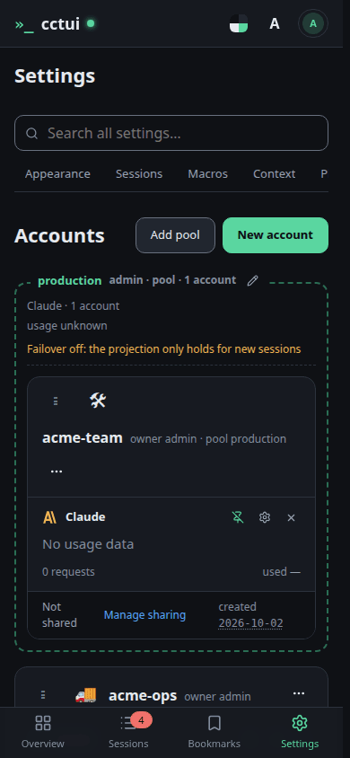

# Connect a provider account

## viewport=desktop theme=dark

**Every account you can run on**

An account is one provider credential — the thing an agent bills its tokens to. This board is the whole list, and until it holds one, nothing can be launched.

**What each card tells you**

A card carries its name and emoji, who owns it, which providers and models it can reach, and how much of its budget is already spent. The grip on its left edge is how it joins a pool.

**A pool is a set of interchangeable accounts**

Aim a session at a pool instead of one account and it elects whichever member has the most budget left, so a weekly limit reached on one account does not stop your work. Drag a card by its grip onto a pool to add it, or use the card’s own menu — the same change without a mouse, which is how it is done on a phone.

**Add your first account**

Open the dialog. You will name the credential, pick its provider and paste the key — nothing leaves this instance, and the key is encrypted before it is stored.

**Close it for now**

Nothing is saved until you submit, so dismissing it changes nothing. Come back with a real key and the board will have its first card — then a session has something to run on.

## viewport=mobile theme=dark

**Every account you can run on**

An account is one provider credential — the thing an agent bills its tokens to. This board is the whole list, and until it holds one, nothing can be launched.

**What each card tells you**

A card carries its name and emoji, who owns it, which providers and models it can reach, and how much of its budget is already spent. The grip on its left edge is how it joins a pool.

**A pool is a set of interchangeable accounts**

Aim a session at a pool instead of one account and it elects whichever member has the most budget left, so a weekly limit reached on one account does not stop your work. Drag a card by its grip onto a pool to add it, or use the card’s own menu — the same change without a mouse, which is how it is done on a phone.

**Add your first account**

Open the dialog. You will name the credential, pick its provider and paste the key — nothing leaves this instance, and the key is encrypted before it is stored.

**Close it for now**

Nothing is saved until you submit, so dismissing it changes nothing. Come back with a real key and the board will have its first card — then a session has something to run on.
