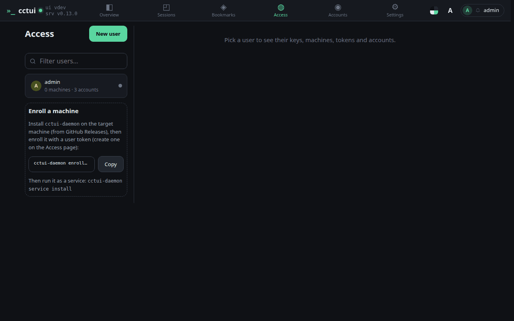
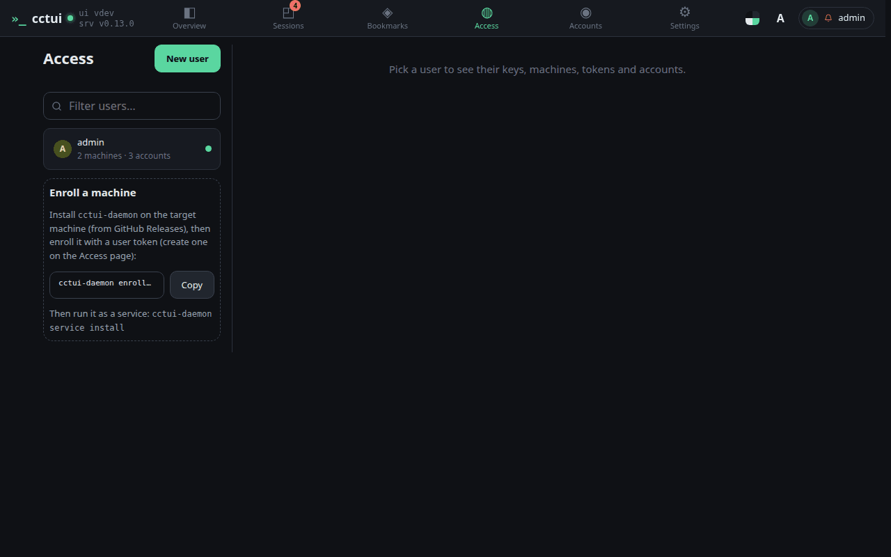
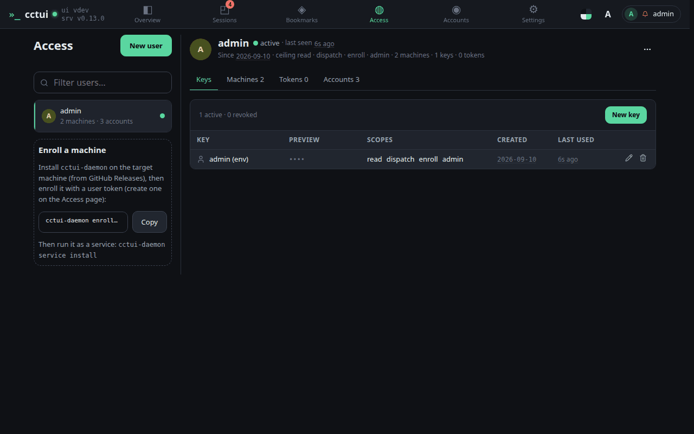
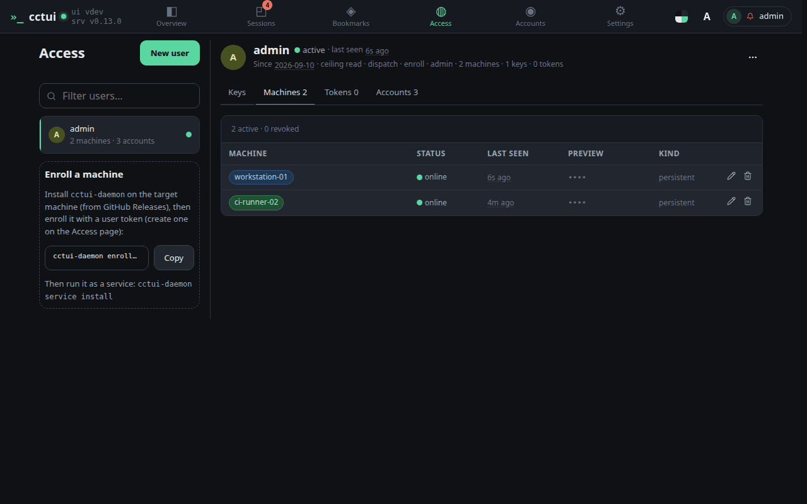

# Bring a machine into the fleet

## viewport=desktop theme=dark

**Start here: enroll a machine**

Access lists everyone and everything that can act on this instance. Until a machine has enrolled, this card is the only thing here that matters.

**What this command does**

It points the daemon at this server and registers the machine under your user. Swap the token placeholder for one of your own keys — that token is what ties the machine to you.

**Waiting for the machine to report in**

The guide moves on by itself the moment the machine checks in. If you would rather finish setting it up later, leave this step and come back — nothing is lost.

**Open your own user**

Everything attached to an identity is here: the keys it signs in with, the machines it enrolled, its tokens and its AI accounts.

**The machines that answered**

The machine you just enrolled is listed here with its heartbeat. Online means it can host a session right now.
