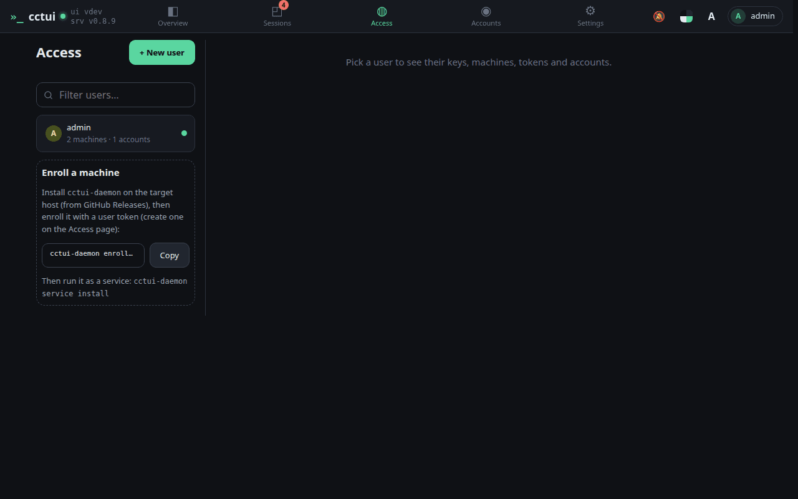
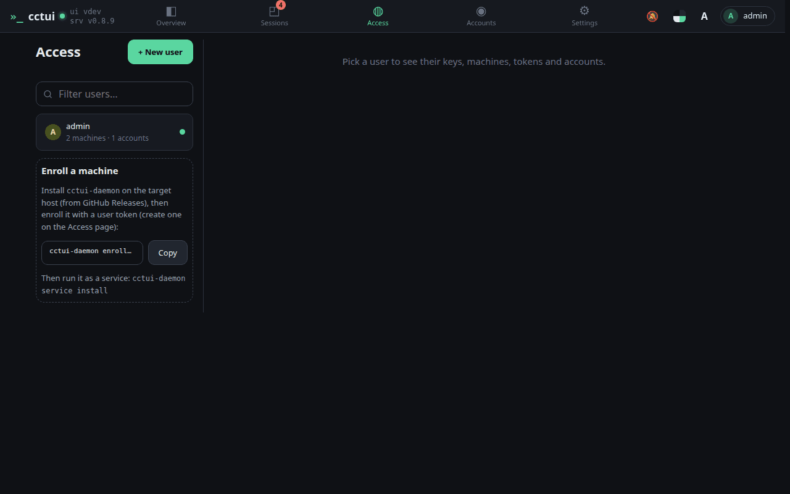

# Bring a machine into the fleet

## viewport=desktop theme=dark

**People, keys and machines**

Everything that can act on this instance is listed here, one user at a time.

**One command per machine**

A machine joins by running the daemon with a user token; from then on it can host sessions.

**Open a user**

Each user carries their own API keys, machines, tokens and AI accounts.

**The machines that answered**

Enrolled machines report in with a heartbeat, so you know which are online.
