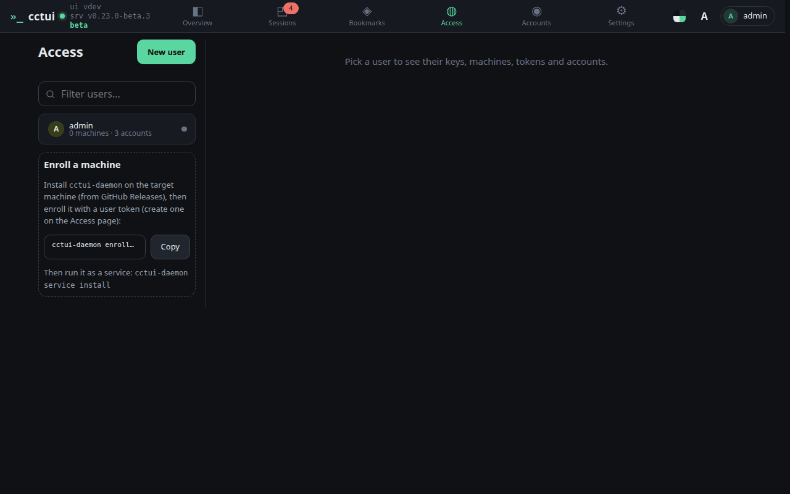
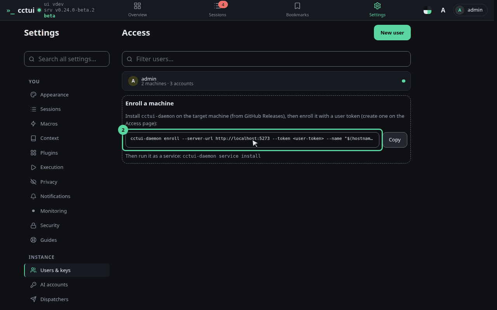
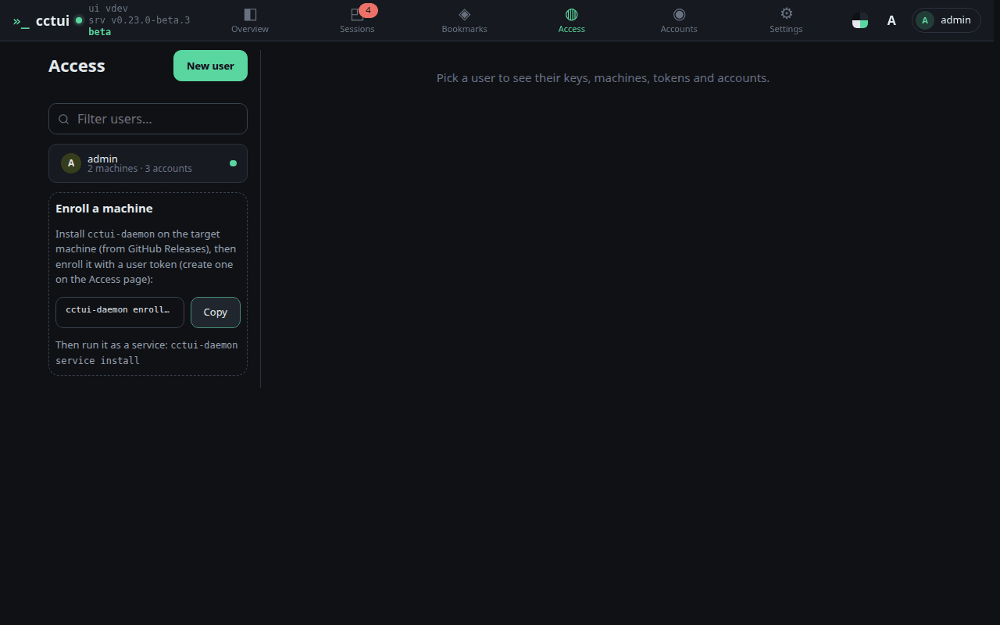
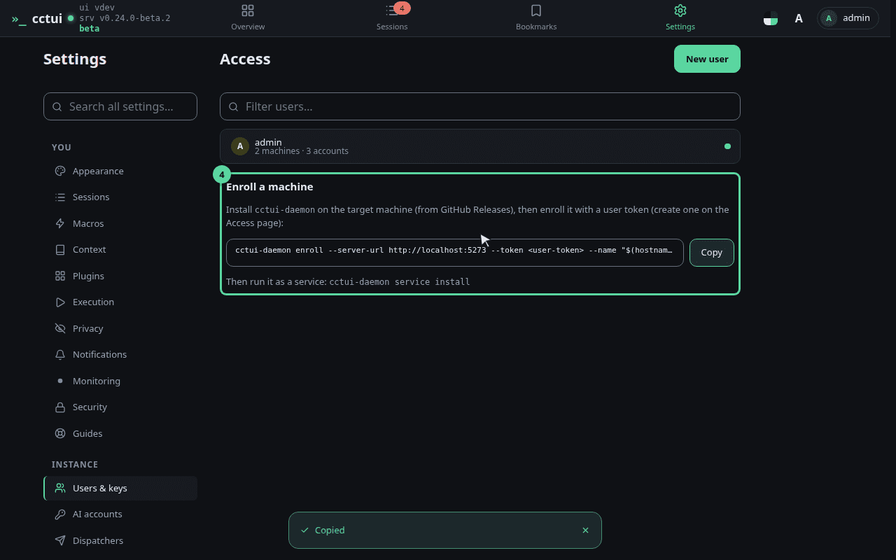
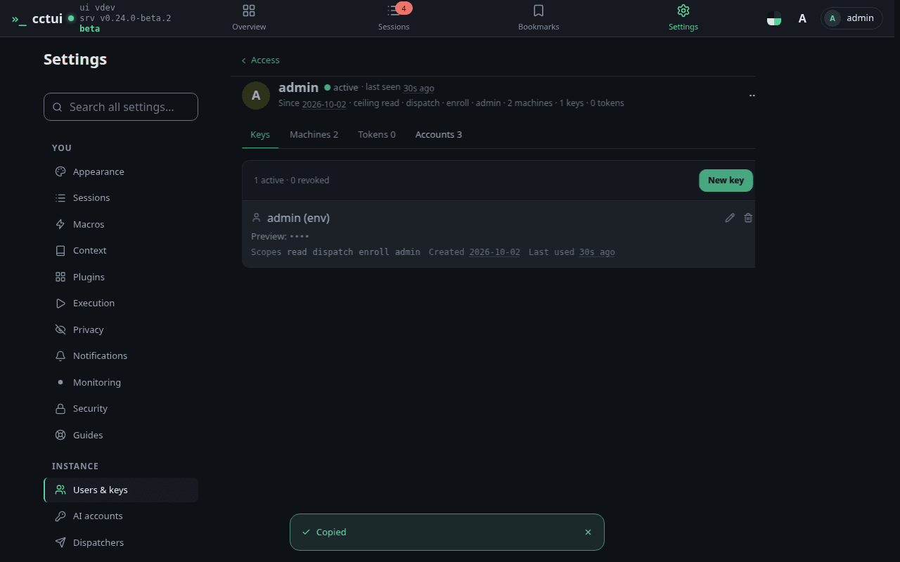
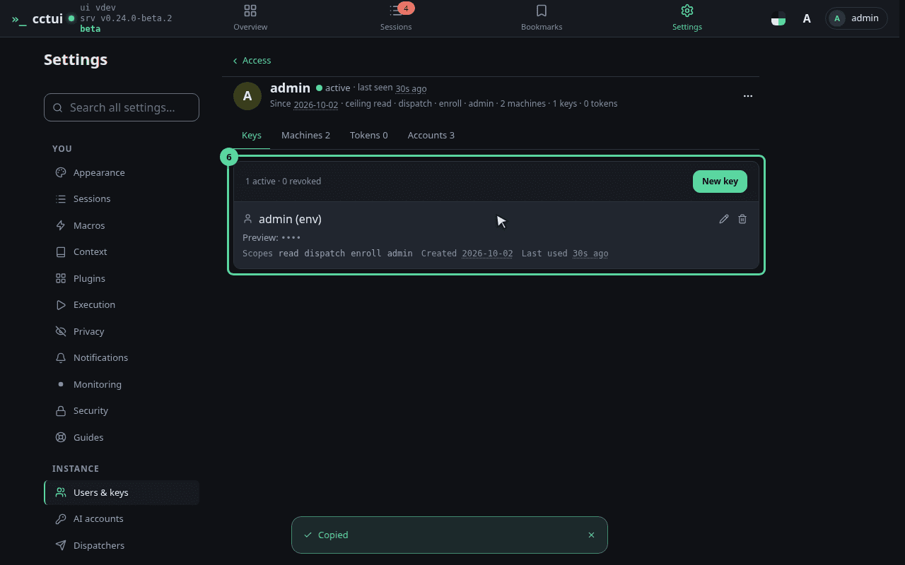

# Bring a machine into the fleet

## viewport=desktop theme=dark

**A machine is where an agent actually runs**

cctui itself runs nothing. A small daemon on your own computer does, and enrolling is how that computer tells this server it exists. Until one has enrolled, this card is the only thing here that matters.

**What this command does**

It points the daemon at this server and registers the machine under your user. The token in it is what ties the machine to you — swap the placeholder for one of your own keys.

**Copy it, then run it over there**

Take the copy now. It has to run on the computer that will host your agents, not in this browser. Install it as a service afterwards and the machine rejoins the fleet by itself after a reboot.

**How you will know it worked**

A machine that has checked in appears under your user as Online, with its last heartbeat. Online is the whole test: it means the machine can host a session right now. Nothing here waits on it — come back whenever the daemon is up.

**Open your own user**

Everything attached to an identity lives here: the keys it signs in with, the machines it enrolled, its tokens, and the AI accounts its agents spend.

**One panel per kind of credential**

Keys sign a person in, tokens let a machine enroll, and accounts are what the agents spend. Revoking any of them takes effect immediately — that is how you retire a lost laptop.
