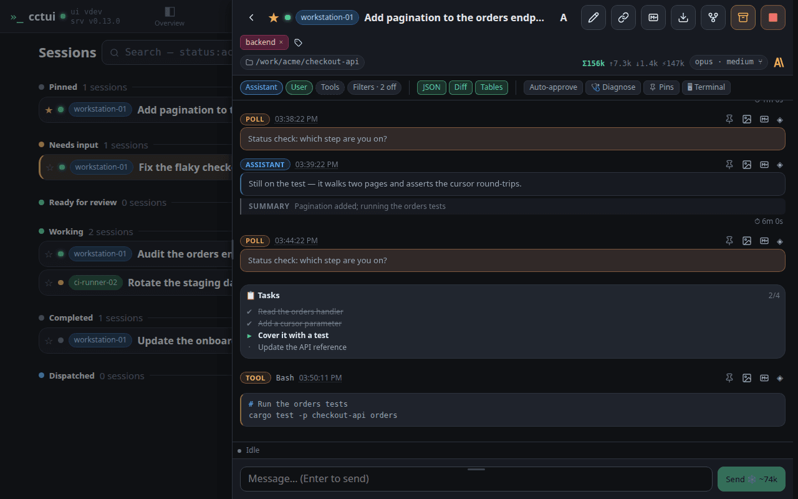
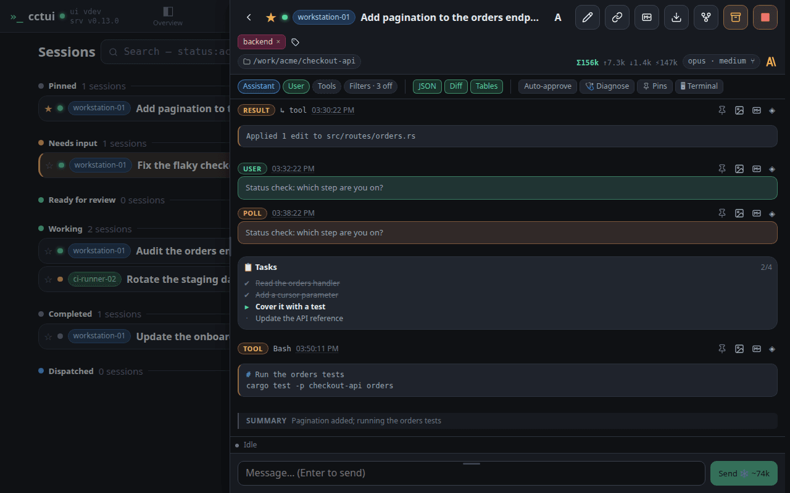
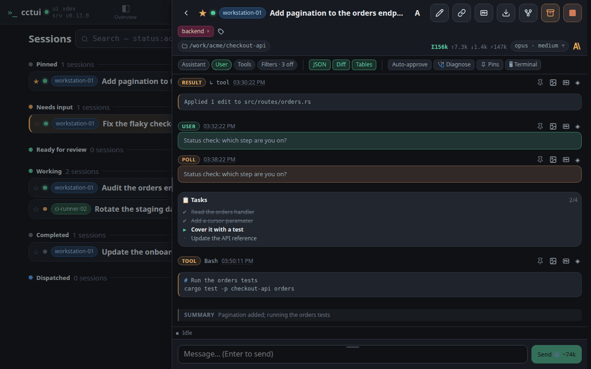

# Follow a session while it works

## viewport=desktop theme=dark

**Open a session**

Open one by its name. The conversation slides in beside the list on a desktop and over it on a phone, so you never lose your place in the fleet.

**Who is running this, and where**

The top row answers the questions you ask first: is it alive, which machine is it on, which account is paying for it, and what is it called.

**Everything it did is on the record**

Each message is badged with its kind: your prompts, the agent’s replies, its reasoning, every tool call and the result that came back. Nothing is summarised away.

**Lift one message out**

Any single message can be pinned to find again, copied as Markdown for a ticket, or saved as an image to paste into a review.

**Hide the noise**

Hiding the assistant messages leaves the tool calls — the fastest way to audit what an agent touched.

**Steer it from here**

Anything you type goes to the running agent, so you can redirect it mid-task instead of stopping it and starting again.
