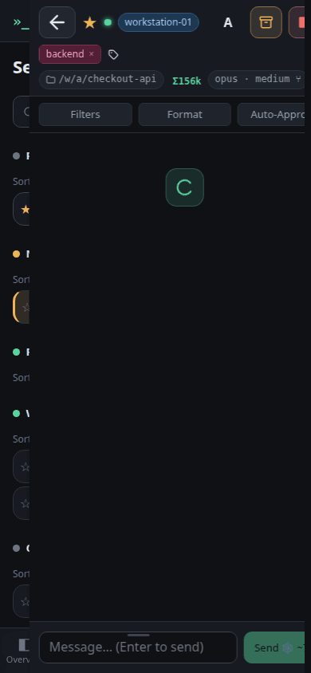
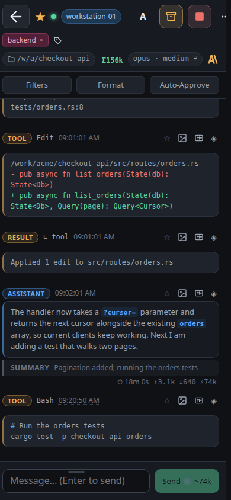
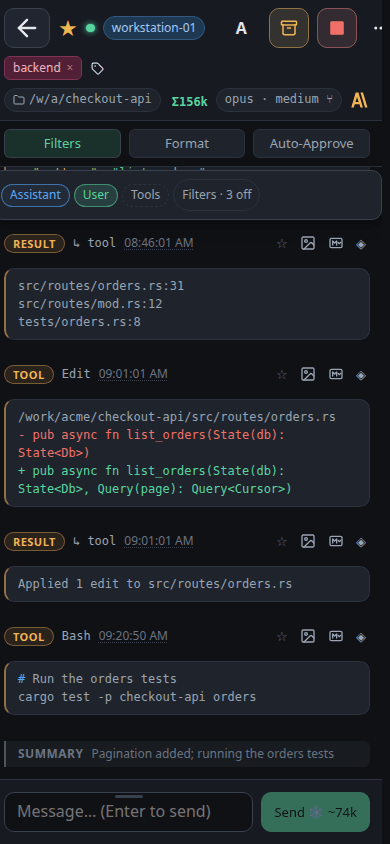
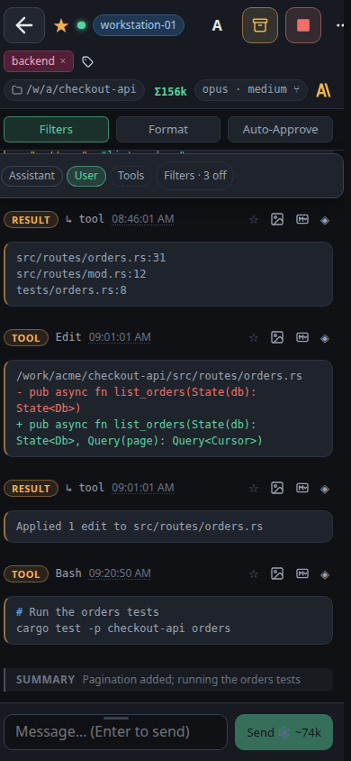

# Follow a session while it works

## viewport=desktop theme=dark

**Open a session**

Open your running session by its name. The conversation opens beside the list on a desktop, over it on a phone.

**Read the whole transcript**

Every prompt, reply, tool call and tool result is kept, so you can see exactly what the agent did.

**Filter the noise**

Hiding the assistant messages leaves the tool calls — the fastest way to audit what an agent touched.

**Steer it from here**

Anything you type here goes to the running agent, so you can redirect it without restarting.

## viewport=mobile theme=dark

**Open a session**

Open your running session by its name. The conversation opens beside the list on a desktop, over it on a phone.

**Read the whole transcript**

Every prompt, reply, tool call and tool result is kept, so you can see exactly what the agent did.

**Filter the noise**

Hiding the assistant messages leaves the tool calls — the fastest way to audit what an agent touched.

**Steer it from here**

Anything you type here goes to the running agent, so you can redirect it without restarting.
