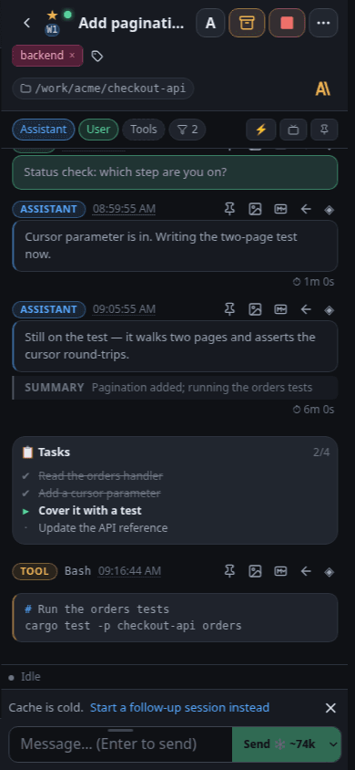
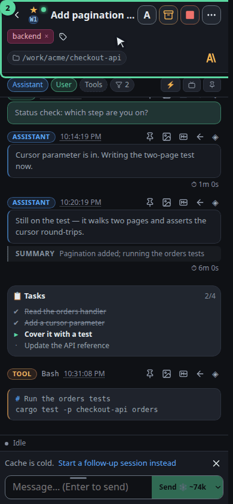
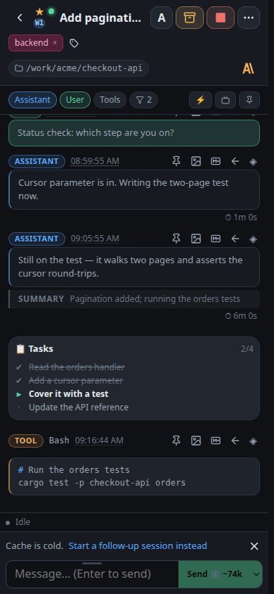
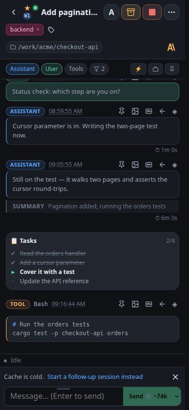
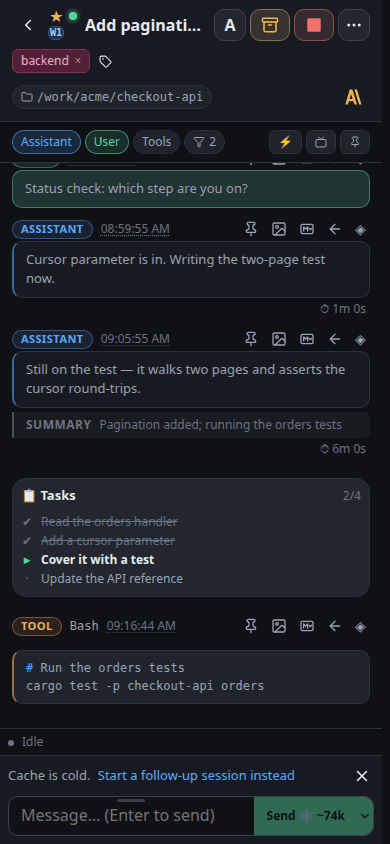
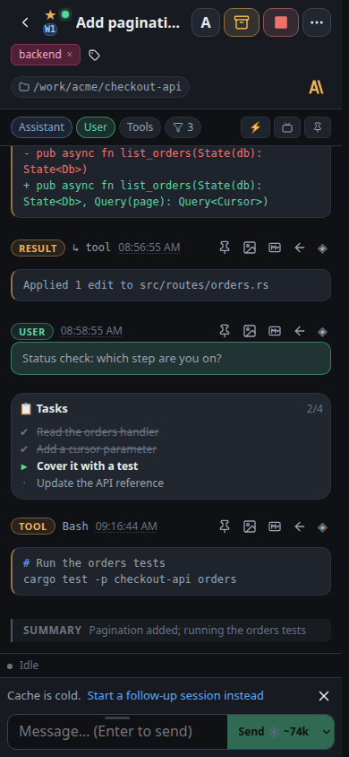
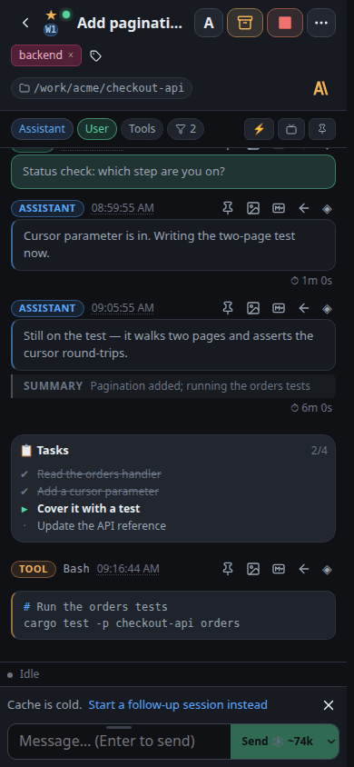
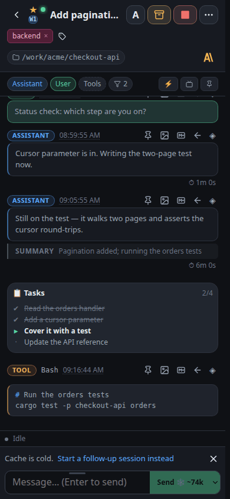

# Follow a session while it works

## viewport=mobile theme=dark

**Open a session**

Open one by its name. The conversation slides in beside the list on a desktop and over it on a phone, so you never lose your place in the fleet.

**Who is running this, and where**

The top row answers the questions you ask first: is it alive, which machine is it on, which account is paying for it, and what is it called.

**The rest of the detail folds away**

Everything that would crowd the header — the full path, the session id, its parent if it was forked — lives behind this toggle, so the two rows above stay readable.

**What it is doing right now**

While a turn is live this strip names the step in progress, the tool it is running, how long the turn has taken and how far through its task list it is. Between turns it simply reads idle — which is how you tell a thinking agent from a finished one.

**Everything it did is on the record**

Each message is badged with its kind: your prompts, the agent’s replies, its reasoning, every tool call and the result that came back. Nothing is summarised away.

**Lift one message out**

Any single message can be pinned to find again, copied as Markdown for a ticket, or saved as an image to paste into a review.

**Try it: leave only what it touched**

Turn the assistant pill off. The prose disappears and the tool calls remain — the fastest way to audit what an agent actually did to your files.

**And put it back**

Click it again. Filters only ever change what this pane shows you — nothing was removed from the transcript, and the setting does not follow you to the next session.

**Steer it from here**

Anything you type goes to the running agent, so you can redirect it mid-task instead of stopping it and starting again.
