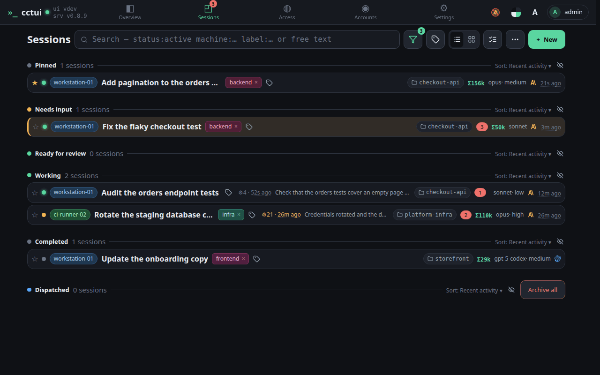
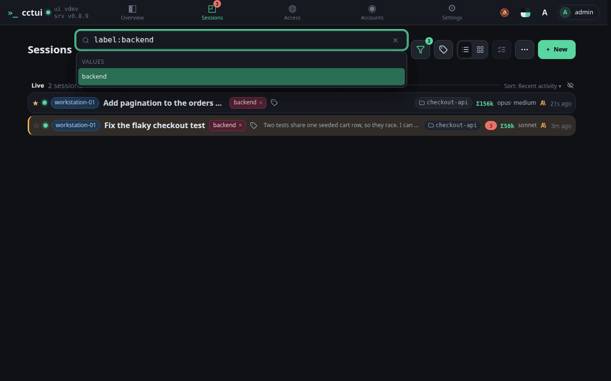

# Find a session again

## viewport=desktop theme=dark

**Start from the whole list**

Every session you have run is searchable, live ones and finished ones alike.

**Search the transcripts, not just the titles**

A plain word is matched against what the agents actually said and did, so you can find a run by what it touched.

**Narrow by label, machine or status**

Typed filters like label:, machine: and status: combine with the free text to cut a large fleet down fast.
