# Find anything across sessions

## viewport=desktop theme=dark

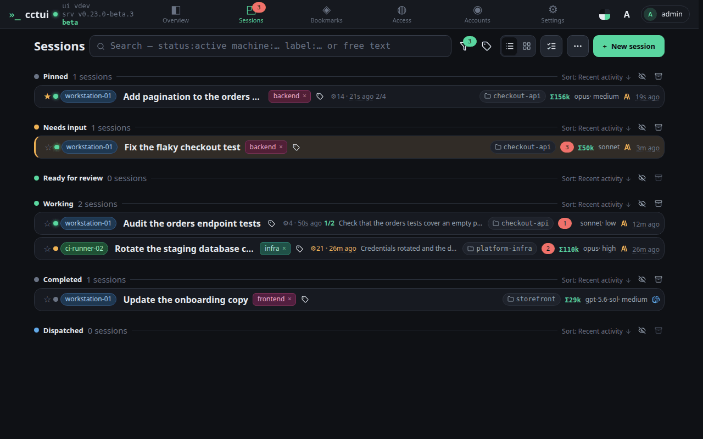

**One box over every session**

This searches what the agents actually said and did, not just the names you gave the runs. A session you never labelled is still findable by what it touched.

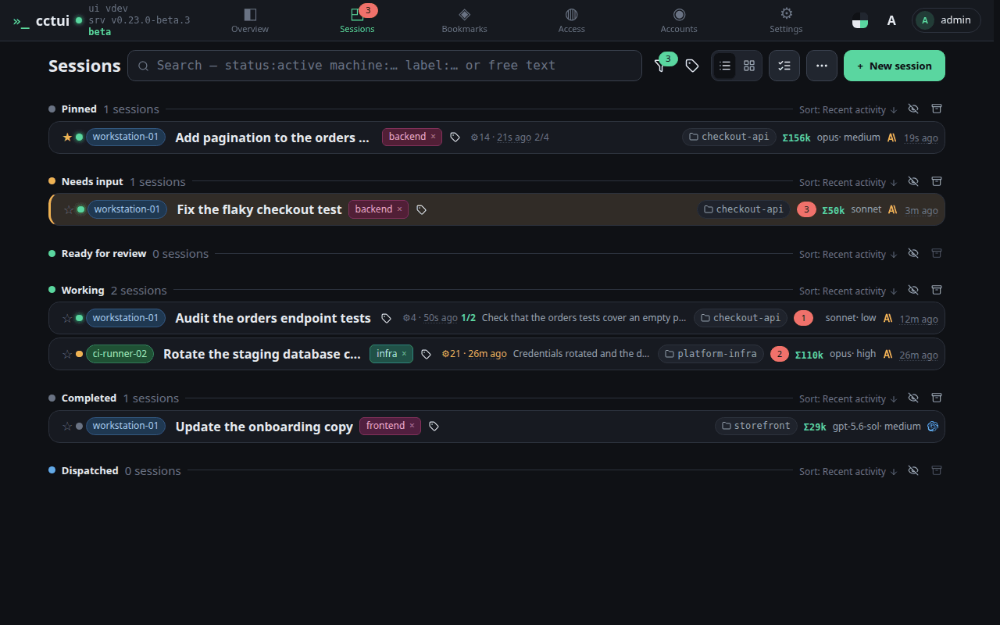

**Everything you have run is in here**

Live runs and finished ones alike. Count the rows now — the next two steps will cut this list down in front of you.

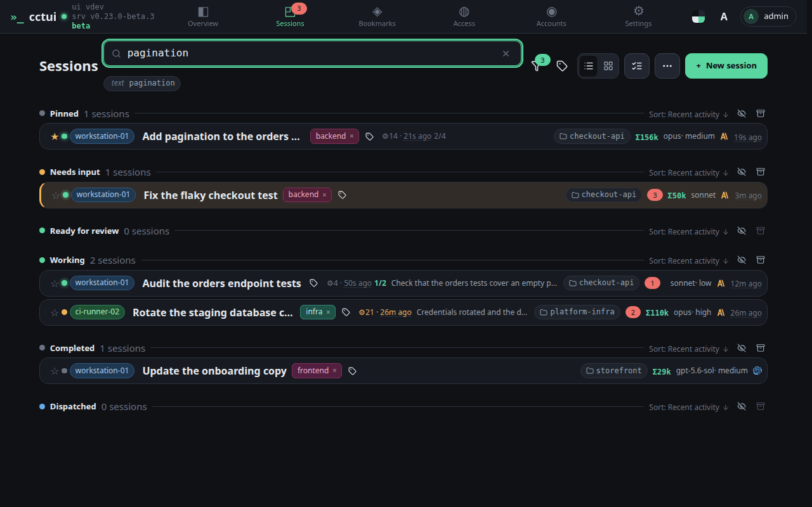

**Type a word the run would have used**

Try “pagination”. A plain word is matched against the transcripts themselves, so you find a session by what it touched rather than by what you called it.

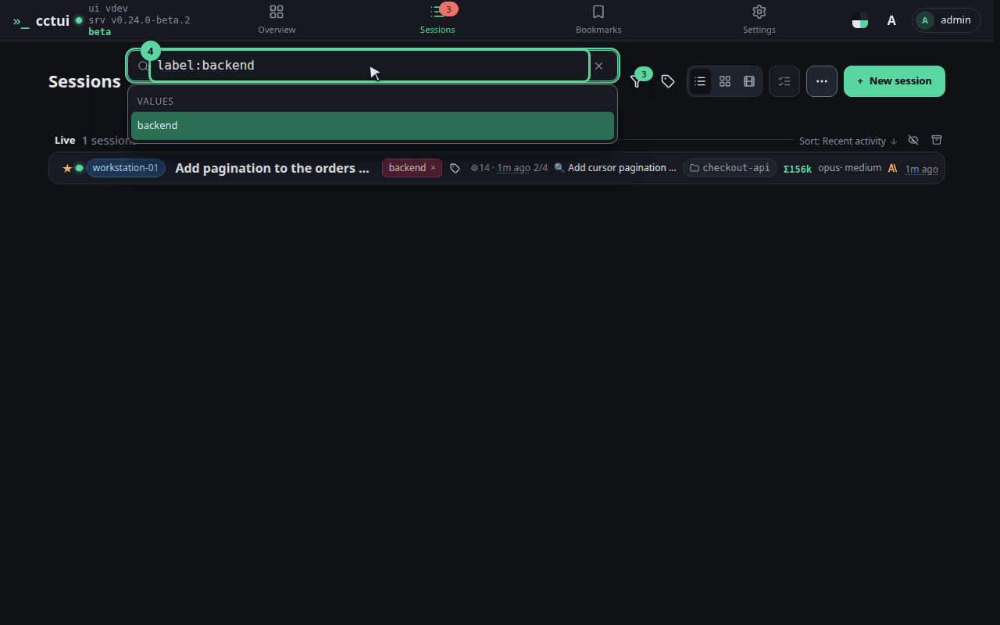

**Turn a word into a condition**

Replace it with “label:backend”. Prefixes like label:, machine: and status: filter instead of searching, and the box offers the values it already knows.

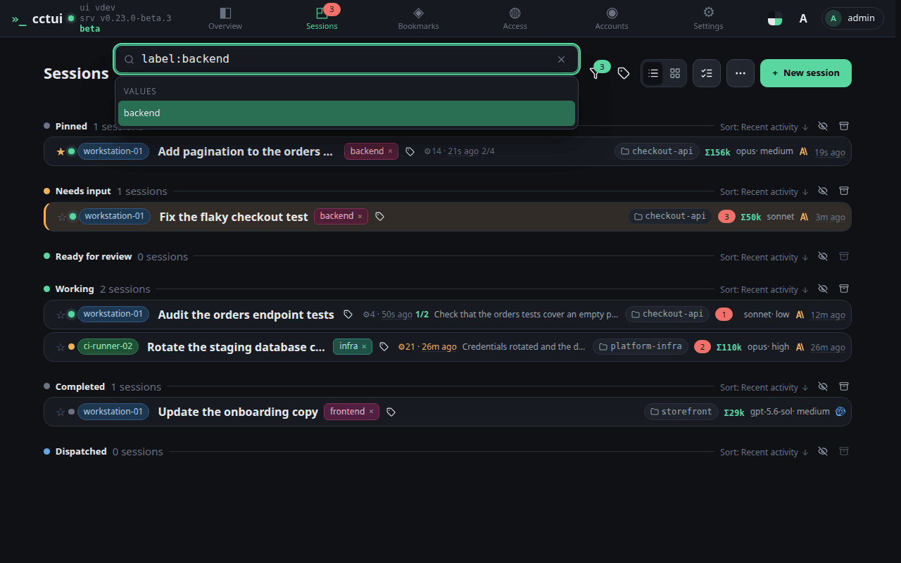

**Stack them to answer a real question**

Conditions and free text apply together: status:failed with a word finds the run that broke on the thing you half-remember. That is the whole query language.

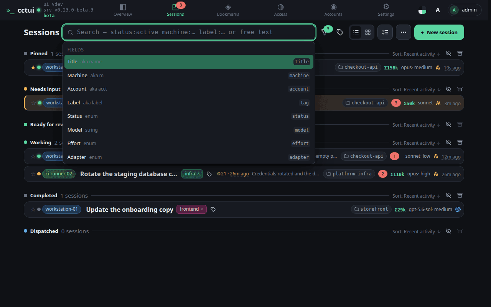

**Empty the box to get the fleet back**

Clear it and every session returns. Nothing was hidden or archived — search only ever changes what this list shows you.

## viewport=mobile theme=dark

**One box over every session**

This searches what the agents actually said and did, not just the names you gave the runs. A session you never labelled is still findable by what it touched.

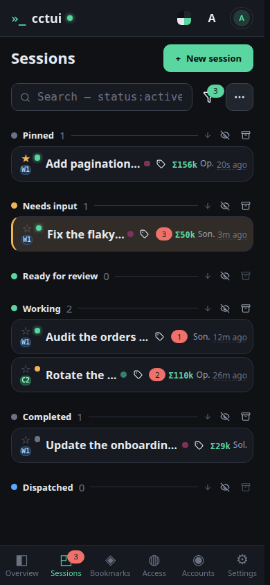

**Everything you have run is in here**

Live runs and finished ones alike. Count the rows now — the next two steps will cut this list down in front of you.

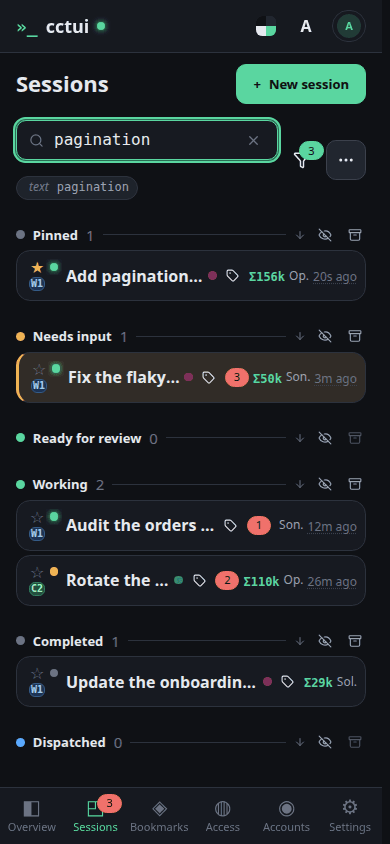

**Type a word the run would have used**

Try “pagination”. A plain word is matched against the transcripts themselves, so you find a session by what it touched rather than by what you called it.

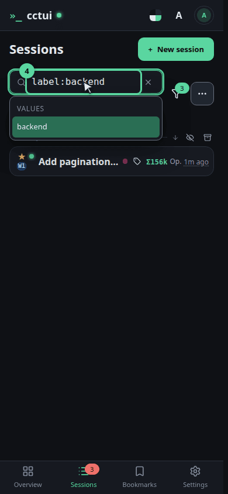

**Turn a word into a condition**

Replace it with “label:backend”. Prefixes like label:, machine: and status: filter instead of searching, and the box offers the values it already knows.

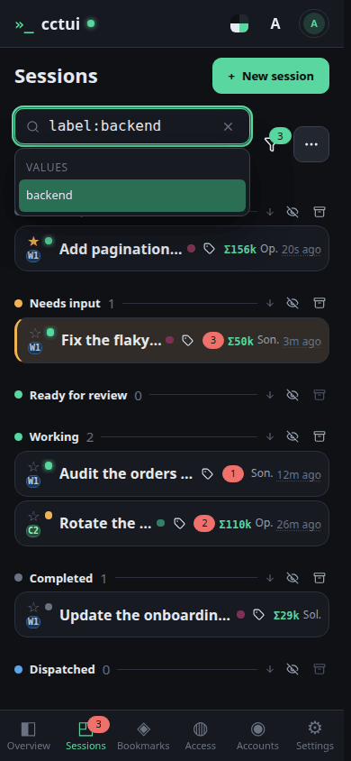

**Stack them to answer a real question**

Conditions and free text apply together: status:failed with a word finds the run that broke on the thing you half-remember. That is the whole query language.

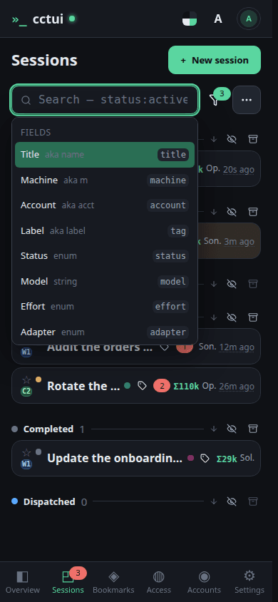

**Empty the box to get the fleet back**

Clear it and every session returns. Nothing was hidden or archived — search only ever changes what this list shows you.
