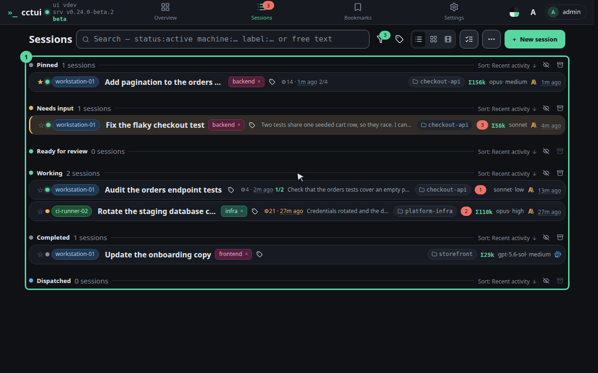
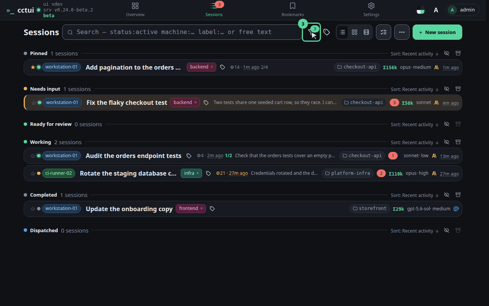
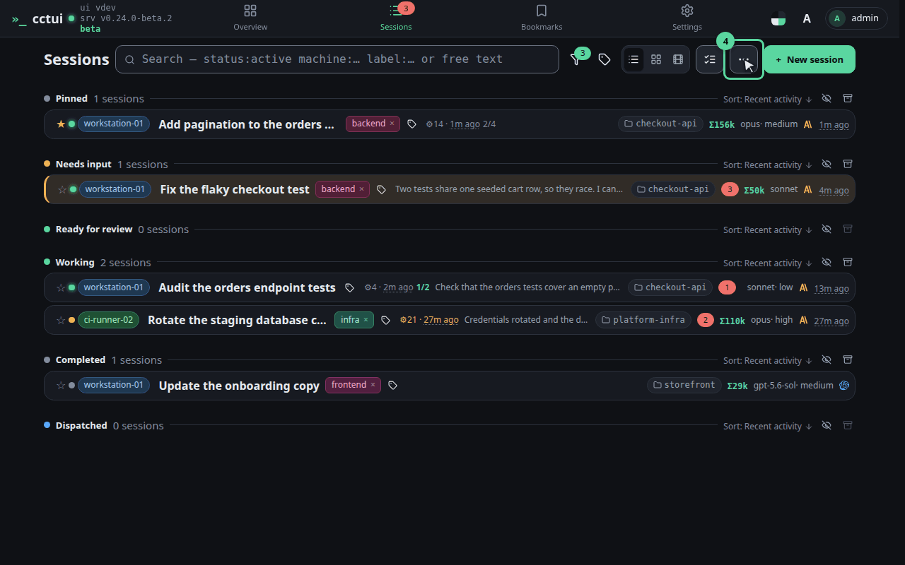
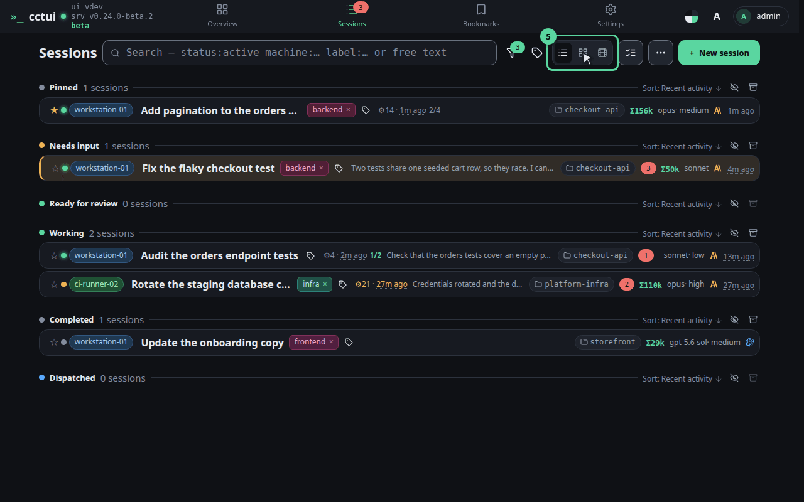
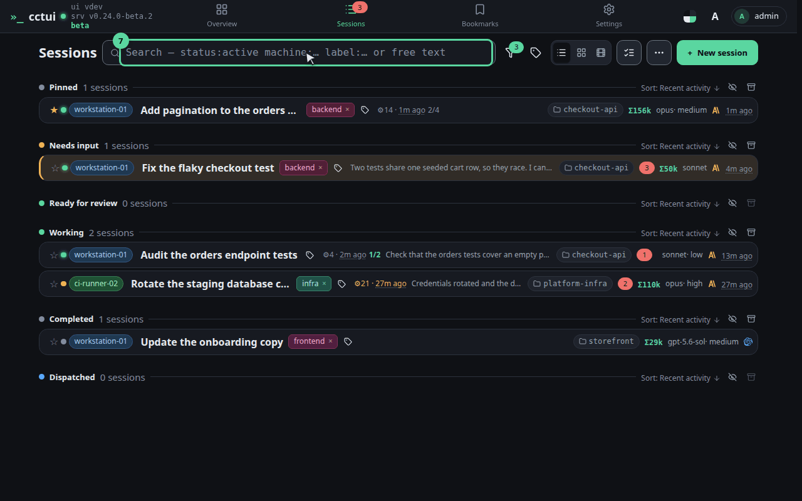
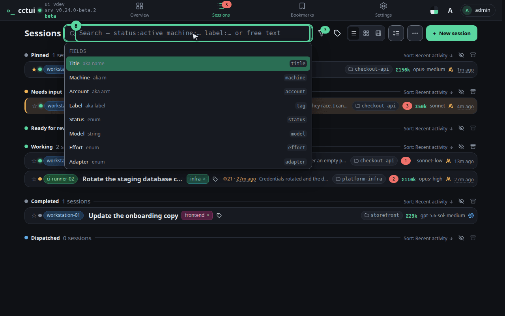

# Read the fleet at a glance

## viewport=desktop theme=dark

**Grouped by what it needs from you**

This is the one screen you will keep open. Agents are not listed by age but by what they are waiting for: anything blocked on an answer from you rises to the top, so a fleet of thirty still reads in one glance.

**What one row tells you**

Each row carries the session’s title, the machine it runs on, the folder it works in, how long since it last did anything, and what it has spent. That is enough to decide whether it needs you without opening it.

**Turn whole groups off**

Behind this button every group is an independent switch — live, blocked, in review, done, archived, and a starred group of your own. Switching off the ones you are not working in is what keeps the list short as the fleet grows.

**Group by whatever you are debugging**

This holds the view settings. Group by machine when you suspect one box, by project when you are context-switching; colour-by tints the rows on a second dimension so you can read both at once. None of it touches the sessions themselves.

**Try it: dense rows or roomy cards**

Switch it here — or in the ⋯ menu when the bar is narrow. Rows fit more of the fleet on screen; cards give each session room for its prompt and its latest activity. Your choice sticks between visits.

**And you can always just type**

Type anything here and the list narrows as you go. There is a whole query language behind this box — conditions on machine, label and status — and a later guide is devoted to it.

**Empty it to get everyone back**

Clear the box and the whole fleet returns, grouped as before. Nothing you did here changed a single session — this screen is a lens, never a lever.
