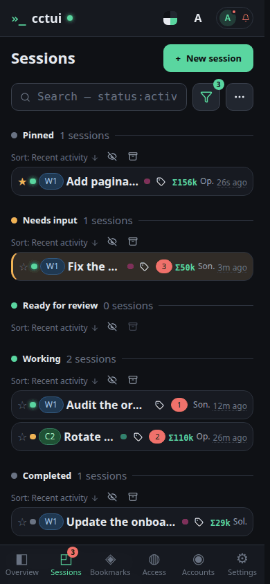
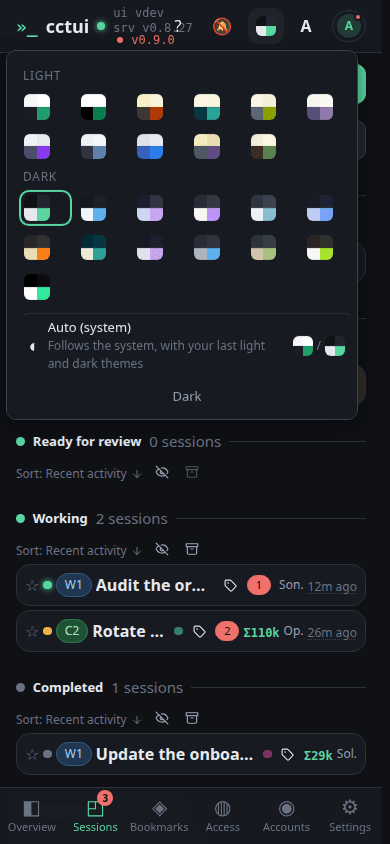

# Read the fleet at a glance

## viewport=desktop theme=dark

**Every screen, in your palette**

Twenty-one built-in themes, light and dark; the whole interface follows the swatch you pick.

## viewport=mobile theme=dark

**Every screen, in your palette**

Twenty-one built-in themes, light and dark; the whole interface follows the swatch you pick.
