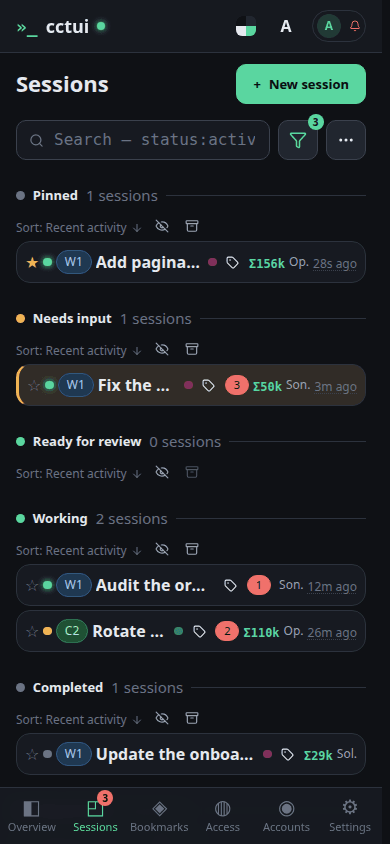
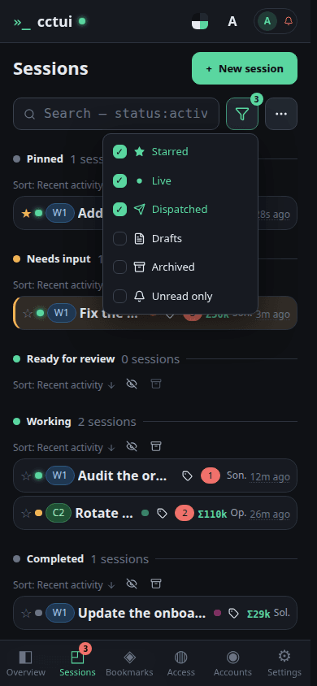
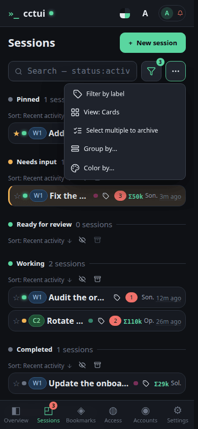

# Read the fleet at a glance

## viewport=mobile theme=dark

**Narrow the list as you type**

Plain words match titles and prompts. Add a field — machine, label, status — to cut straight to a slice of the fleet instead of scrolling it.

**Keep the ones that matter in reach**

Starred sessions get their own group above everything else — the fastest way to pin the two or three runs you actually care about today.

**Group by whatever you are debugging**

Group by machine when you suspect one box, by project when you are context-switching. Colour-by tints the cards on a second dimension, so you can read both at once.

**Collapse or clear a whole group**

The eye folds a group away without losing it. Beside it, archive retires every session in that group in one move — how a finished batch leaves the list for good.
