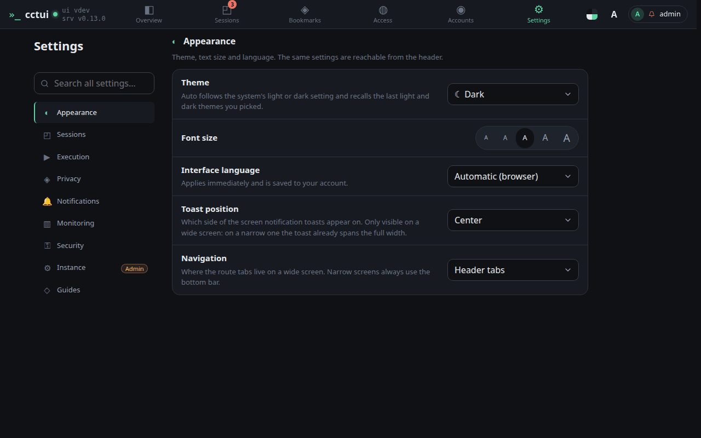
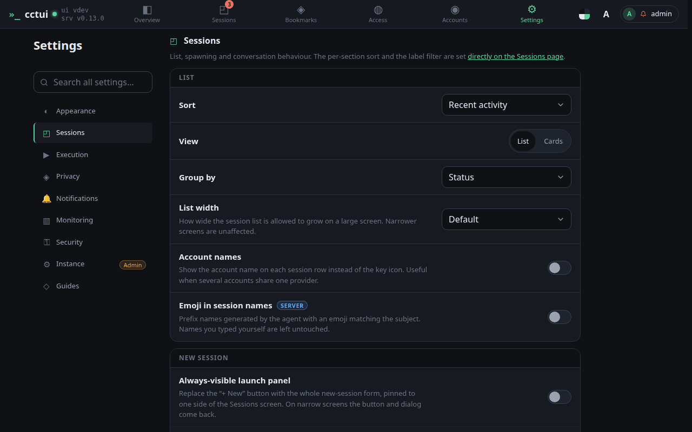
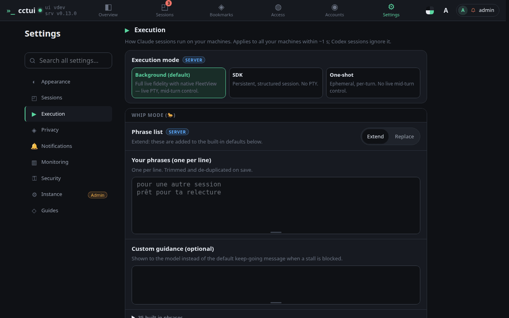
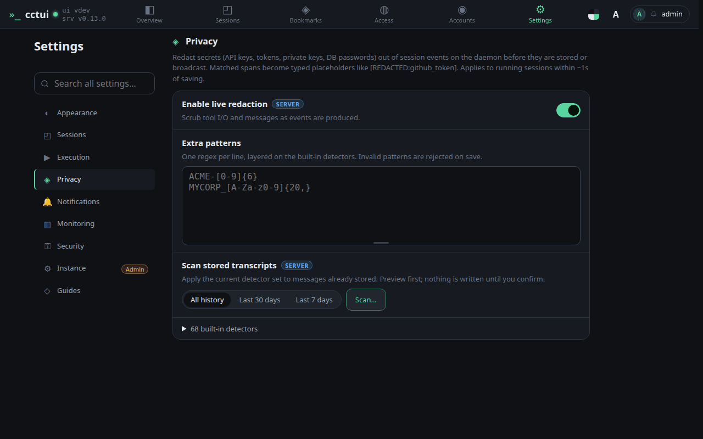

# Tune how agents behave

## viewport=desktop theme=dark

**Make it yours**

Theme, text size, language and where the navigation sits. Every one of these is remembered per account, so the app looks the same on your phone as on your desk.

**Pick a theme, or let it follow the system**

Auto remembers one light and one dark theme and swaps between them as your system does. Pick a specific theme instead and it stays put at every hour of the day.

**Defaults for every run**

How the list sorts and groups, and what a new session starts with, so you set it once instead of every time. The conversation options here also decide how much of a transcript you see at a glance.

**How much rope an agent gets**

Permission handling, auto-approval and the phrases that mean an agent has stopped early rather than finished.

**Secrets never reach the transcript**

Tokens and keys are detected and replaced before anything is stored, so a leaked credential does not end up sitting in your history.
