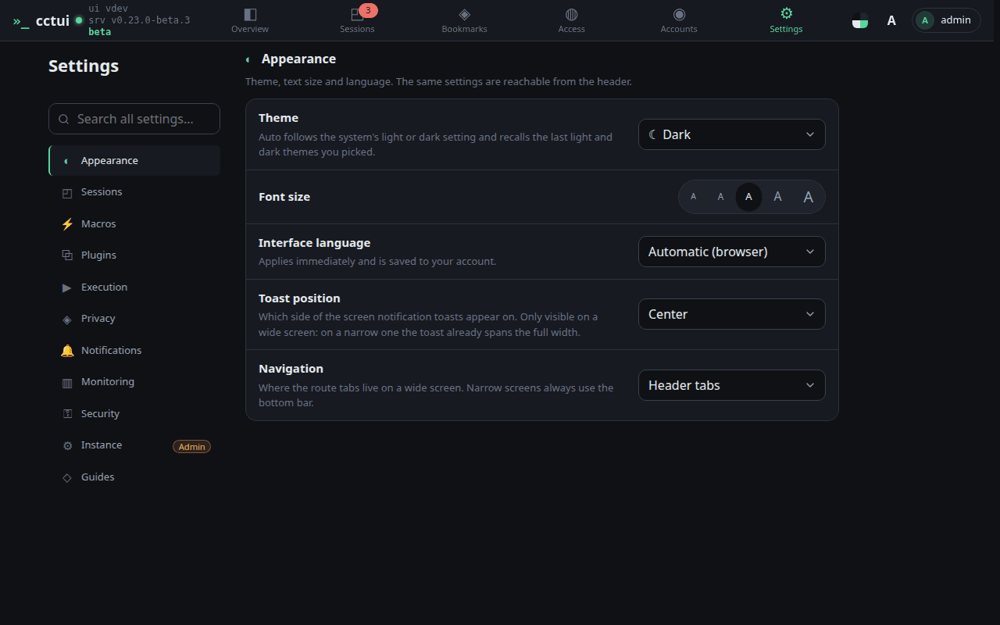
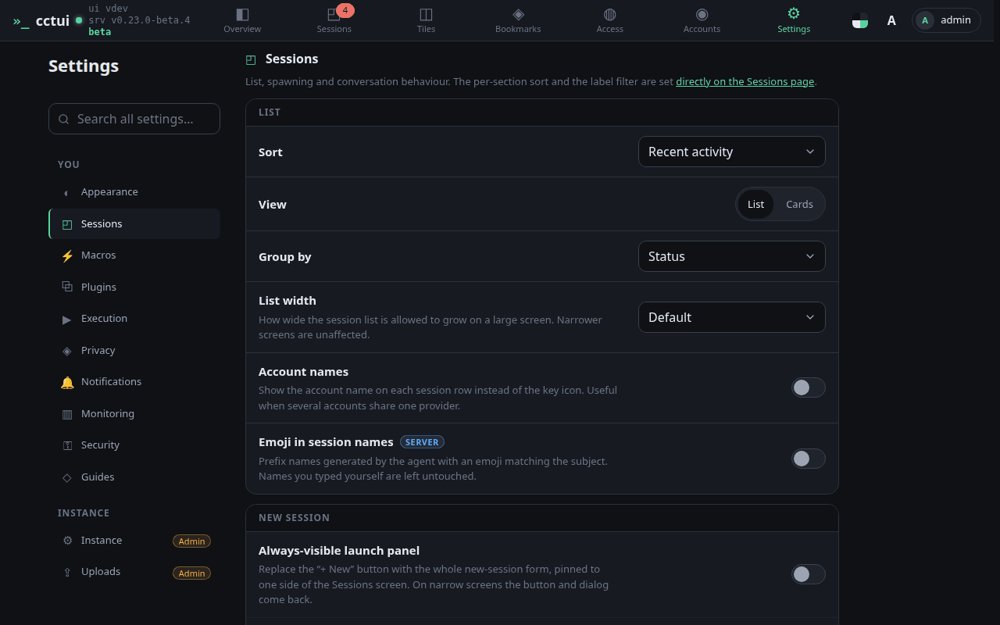
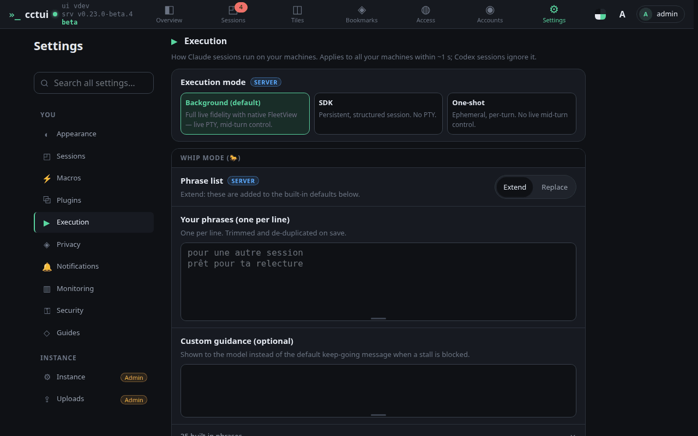
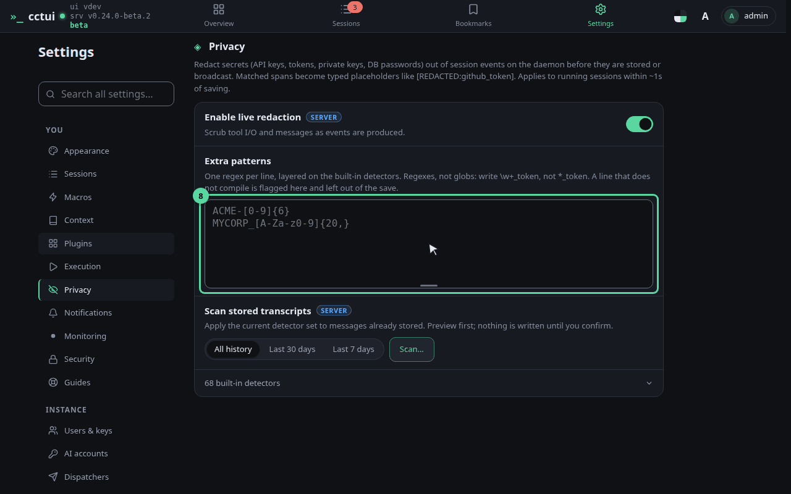
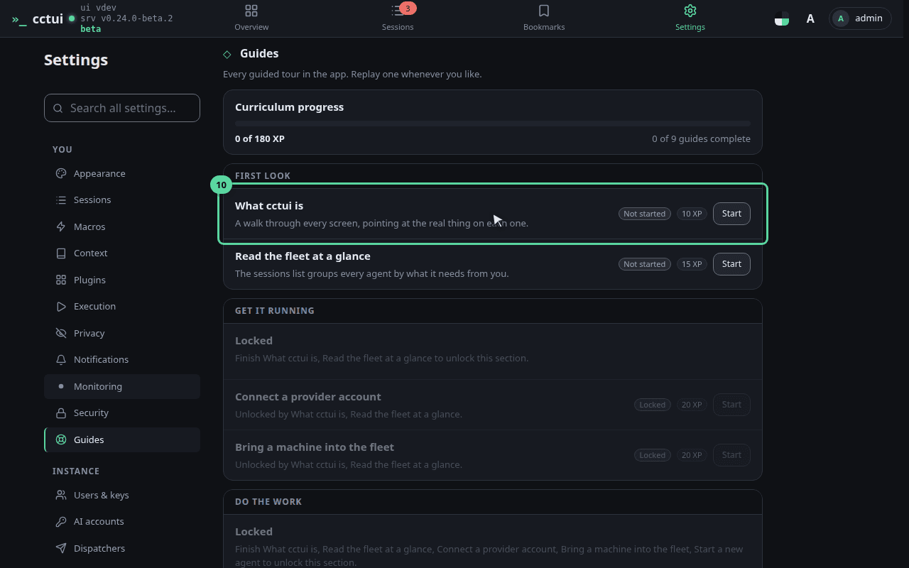

# Tune how agents behave

## viewport=desktop theme=dark

**Start with the one you will look at all day**

Pick a theme, or let it follow the system so it turns dark when your desktop does. Every setting on these pages saves itself the moment you change it — there is no Save button anywhere in Settings.

**The interface language**

Switching it re-draws the app immediately, including a guide you happen to have open — this one will follow you into French mid-sentence if you try it.

**Defaults for every run**

This page decides how the sessions list and the conversation behave before you touch either — sort order, density, grouping, and this one: whether a dropped connection silently resumes the run or leaves it for you to notice.

**The single most consequential setting**

How much rope an agent gets: whether it asks before each action, or edits and runs commands on its own. Loosen it and agents finish far more without you — and can do far more damage unattended. Decide it deliberately, per machine you trust.

**Secrets never reach the transcript**

Anything matching these patterns is redacted before a transcript is stored, so a key pasted into a prompt does not end up in the history. Add the shapes only you would recognise — your own token prefixes, internal hostnames.

**Every guide lives here**

This page is the curriculum: what each guide teaches, what it is worth, and what is still locked. Replay any of them whenever you like — nothing here changes your instance. There are more pages than the four we walked; notifications, plugins, macros and the admin ones are all worth a look once you are running.
