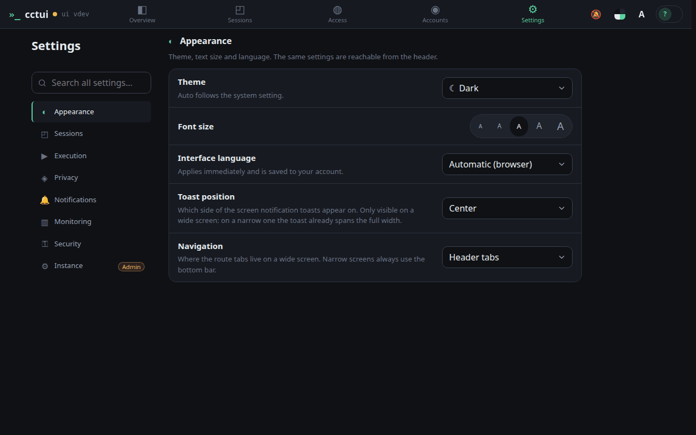
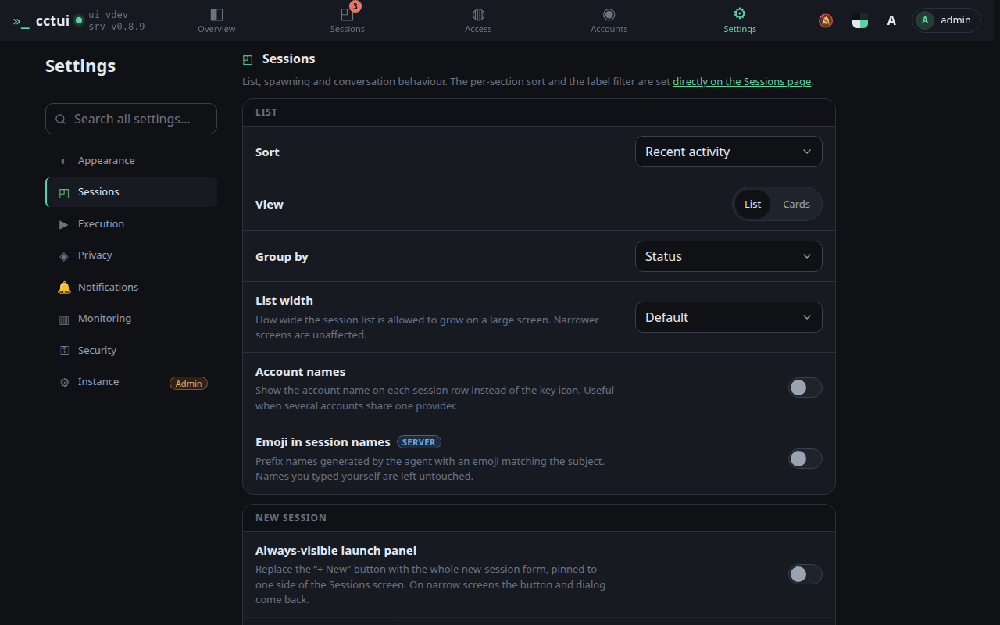
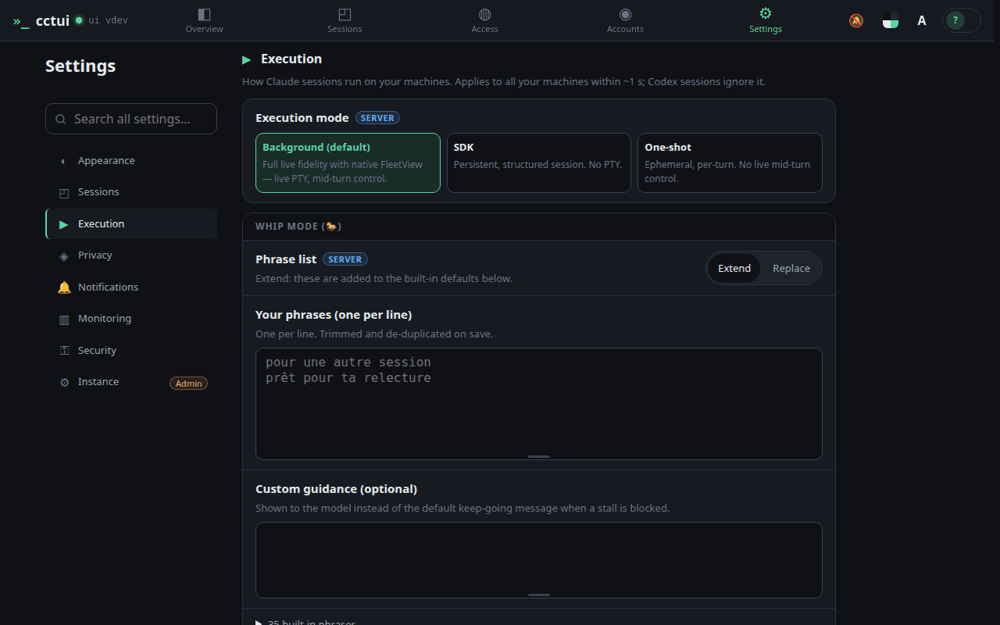
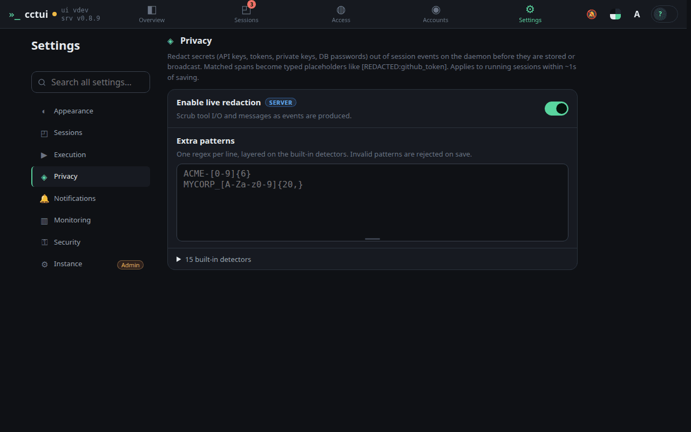
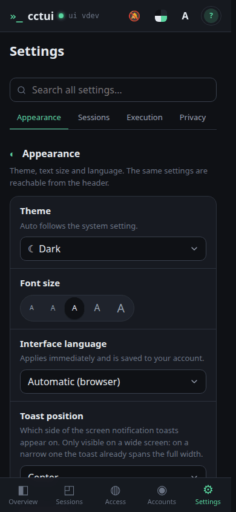
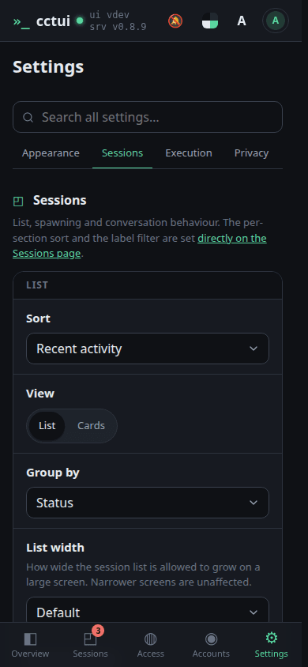
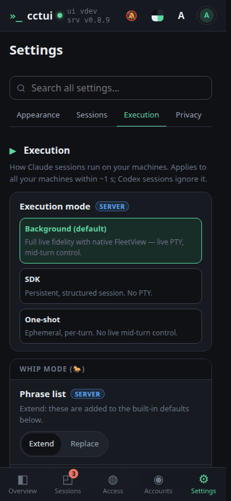
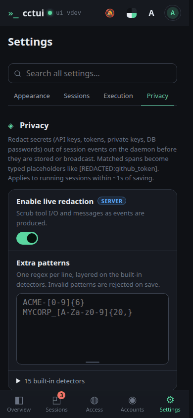

# Tune how agents behave

## viewport=desktop theme=dark

**Make it yours**

Theme, font size, language, and where the navigation sits — the whole interface follows the theme you pick.

**Defaults for every run**

How the list sorts and groups, and what a new session starts with, so you set it once instead of every time.

**How much rope an agent gets**

Permission handling, auto-approval and the phrases that mean an agent has stopped early rather than finished.

**Secrets never reach the transcript**

Tokens and keys are detected and replaced before anything is stored, and you can add patterns of your own.

## viewport=mobile theme=dark

**Make it yours**

Theme, font size, language, and where the navigation sits — the whole interface follows the theme you pick.

**Defaults for every run**

How the list sorts and groups, and what a new session starts with, so you set it once instead of every time.

**How much rope an agent gets**

Permission handling, auto-approval and the phrases that mean an agent has stopped early rather than finished.

**Secrets never reach the transcript**

Tokens and keys are detected and replaced before anything is stored, and you can add patterns of your own.
