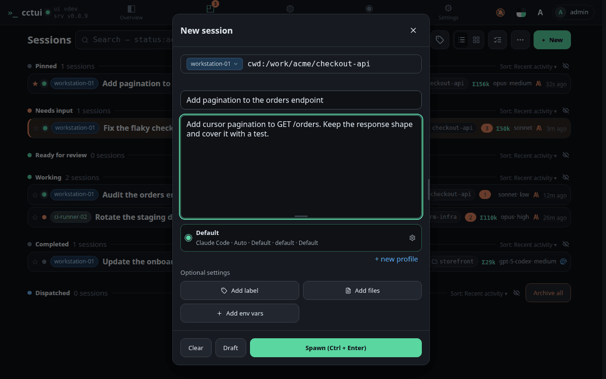
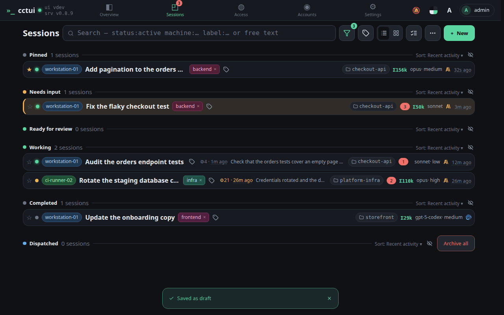
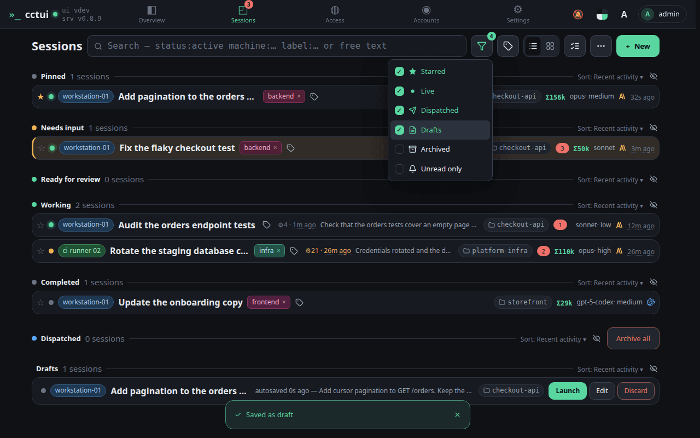
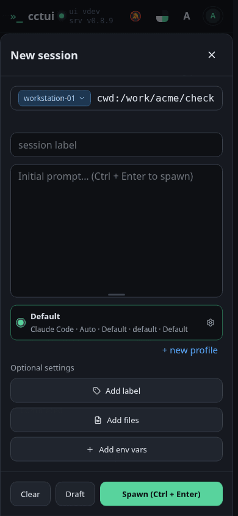
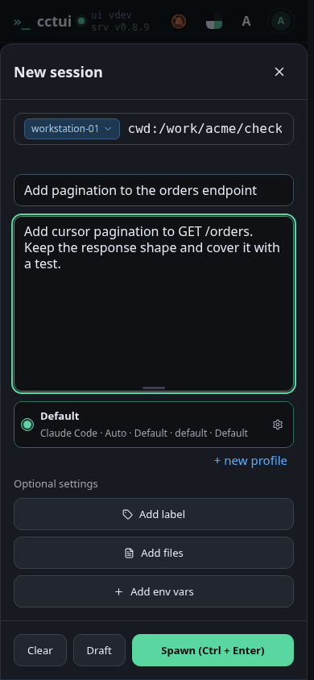
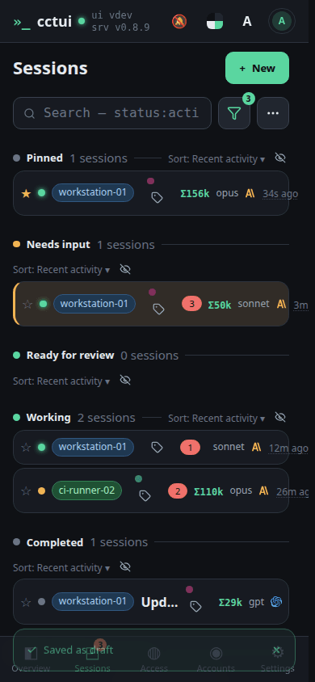
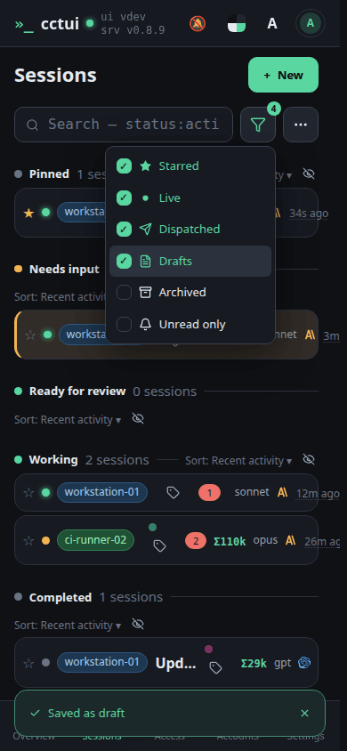

# Start a new agent

## viewport=desktop theme=dark

**Open the new-session dialog**

One dialog covers everything a run needs: the machine, the folder, the prompt and the profile. It opens on the folder you used last.

**Say what you want done**

The prompt is the whole brief; the profile below it decides which harness, model and folder carry it out.

**Keep it for later**

Saving a draft parks the whole configuration in the list, ready to launch when you are.

**The draft is waiting**

Drafts sit in their own section, holding the machine, folder, profile and prompt until you launch them.

## viewport=mobile theme=dark

**Open the new-session dialog**

One dialog covers everything a run needs: the machine, the folder, the prompt and the profile. It opens on the folder you used last.

**Say what you want done**

The prompt is the whole brief; the profile below it decides which harness, model and folder carry it out.

**Keep it for later**

Saving a draft parks the whole configuration in the list, ready to launch when you are.

**The draft is waiting**

Drafts sit in their own section, holding the machine, folder, profile and prompt until you launch them.
