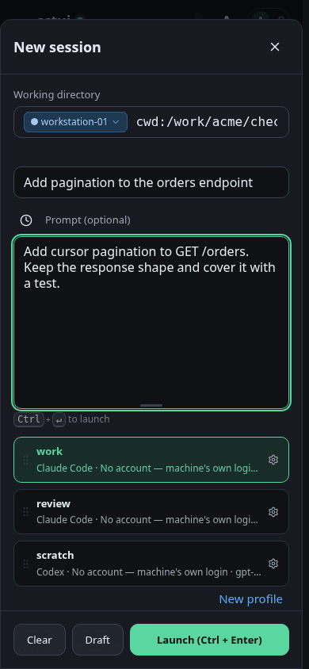
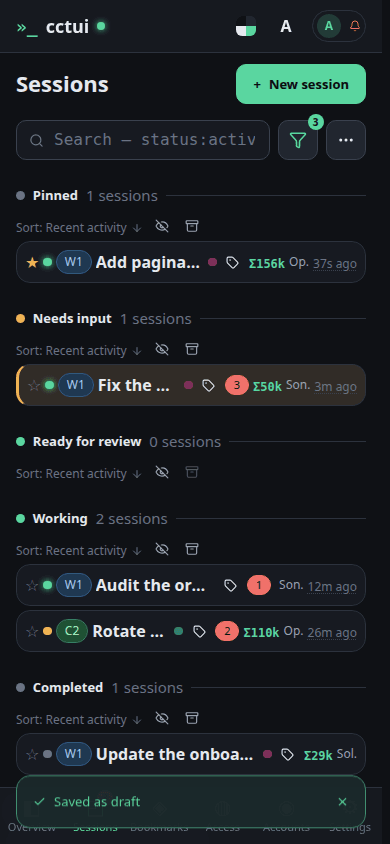
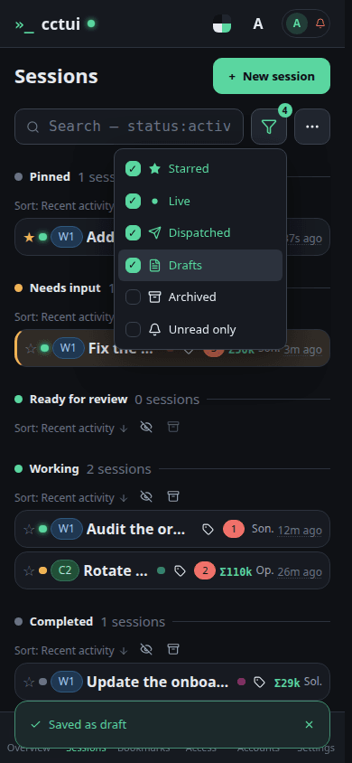

# Start a new agent

## viewport=mobile theme=dark

**Open the new-session dialog**

Everything a run needs is in this one dialog: the machine, the folder, the prompt and the profile.

**Say what you want done**

Say what you want done. The profile below decides which harness and model carry it out.

**The profile decides how it thinks**

A profile bundles the harness, model, reasoning effort and permission mode. Pick one here rather than setting four things every time you launch.

**Save it as a draft**

The Draft button lights up once the machine and folder are set. This saves the run on your instance without starting it — nothing executes until you launch it.

**The draft is waiting**

Your draft is here, holding the machine, folder, profile and prompt until you launch it.
