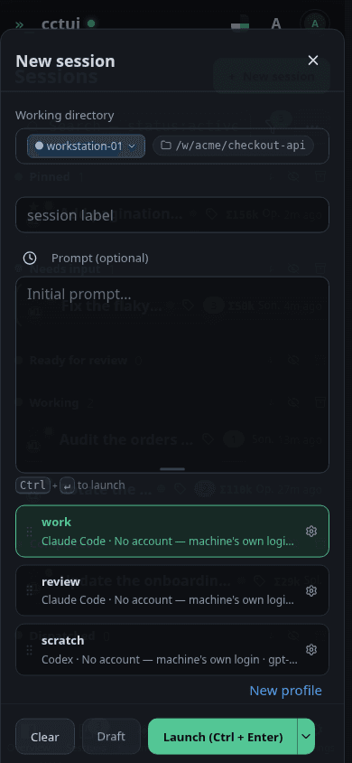
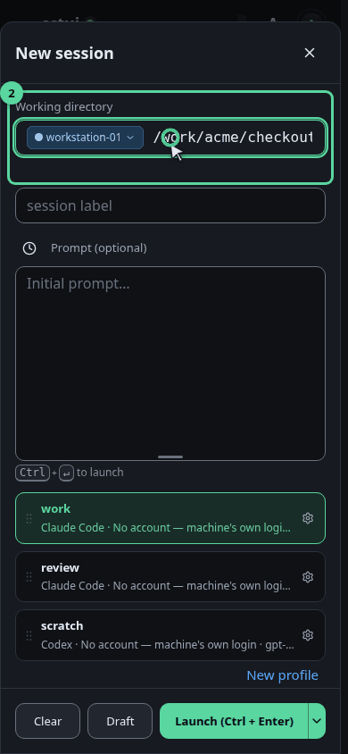
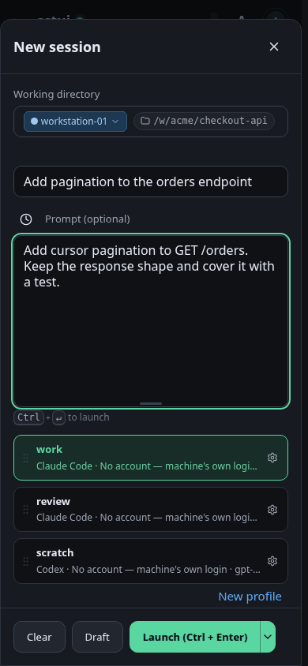
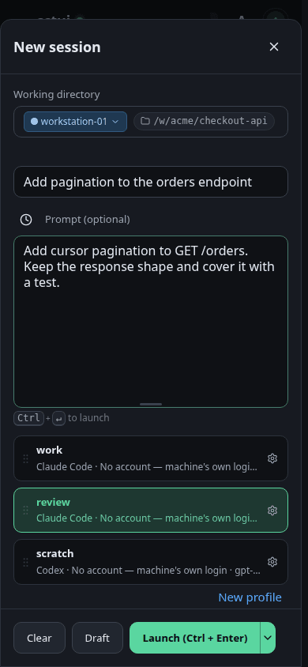
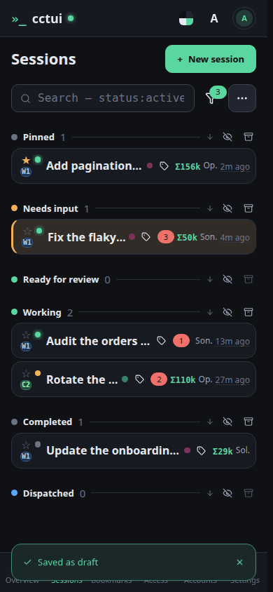

# Start a new agent

## viewport=mobile theme=dark

**Open the new-session dialog**

Everything a run needs is in this one dialog: the machine, the folder, the prompt and the profile. If you docked it beside the list, it is already open.

**Pick where it runs**

Choose the machine, then the folder. That folder is the agent’s whole world — it reads and edits what is inside it and nothing else, so point it at the project you actually mean. Set them now.

**Say what you want done**

This is the agent’s brief, and it is the whole instruction — it will not ask what you meant before it starts. Be as specific as you would be with a new colleague.

**The profile decides how it thinks**

A profile bundles four things: the harness, the model, how hard it reasons, and how much it may do without asking. Pick one rather than setting all four every launch — keep a cheap one for throwaway work and a careful one for the rest.

**Draft it rather than launch it**

Launch would start the agent now — it would begin reading and editing the folder you chose. Draft, beside it, saves all of this and runs nothing. Press Draft: you can launch it whenever you like.

**Where the draft went**

Drafts have their own group in the list, switched off until you ask for it — behind this button, with all the other groups. Your run waits there with its machine, folder, profile and prompt intact, and nothing executes until you launch it.
