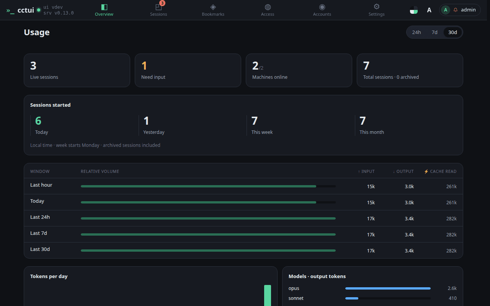
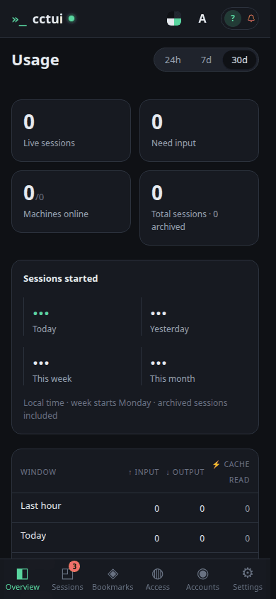
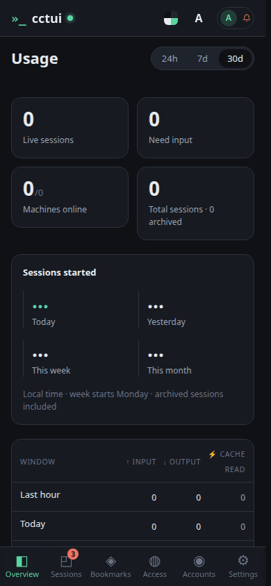

# See what the fleet is costing

## viewport=desktop theme=dark

**The fleet in four numbers**

Sessions running now, sessions waiting on you, machines online, and the all-time total. They read zero until your first run.

**Is today busier than usual?**

The same count over today, yesterday, this week and this month. One day on its own means little; next to the others it tells you whether the fleet is speeding up.

**Tokens by time window**

The same usage read over the last hour, day, week and month, split into input, output and cached tokens. Cached tokens are re-read context and cost a fraction of fresh input.

**Where the tokens went**

Daily volume and a per-model breakdown, so an expensive habit shows up before the bill does. A model you did not mean to use is usually visible here first.

## viewport=mobile theme=dark

**The fleet in four numbers**

Sessions running now, sessions waiting on you, machines online, and the all-time total. They read zero until your first run.

**Is today busier than usual?**

The same count over today, yesterday, this week and this month. One day on its own means little; next to the others it tells you whether the fleet is speeding up.

**Tokens by time window**

The same usage read over the last hour, day, week and month, split into input, output and cached tokens. Cached tokens are re-read context and cost a fraction of fresh input.

**Where the tokens went**

Daily volume and a per-model breakdown, so an expensive habit shows up before the bill does. A model you did not mean to use is usually visible here first.
