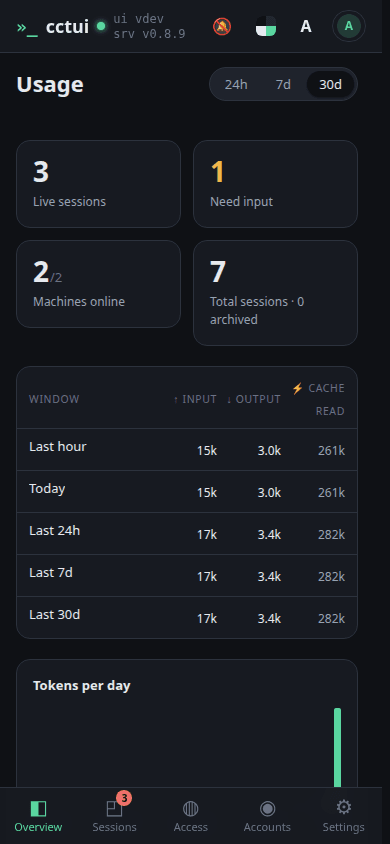

# See what the fleet is costing

## viewport=mobile theme=dark

**The fleet in four numbers**

Sessions running now, sessions waiting on you, machines online, and the all-time total.

**Tokens by time window**

The same usage read over the last hour, day, week and month, split into input, output and cached tokens.

**Where the tokens went**

Daily volume and a per-model breakdown, so an expensive habit shows up before the bill does.
