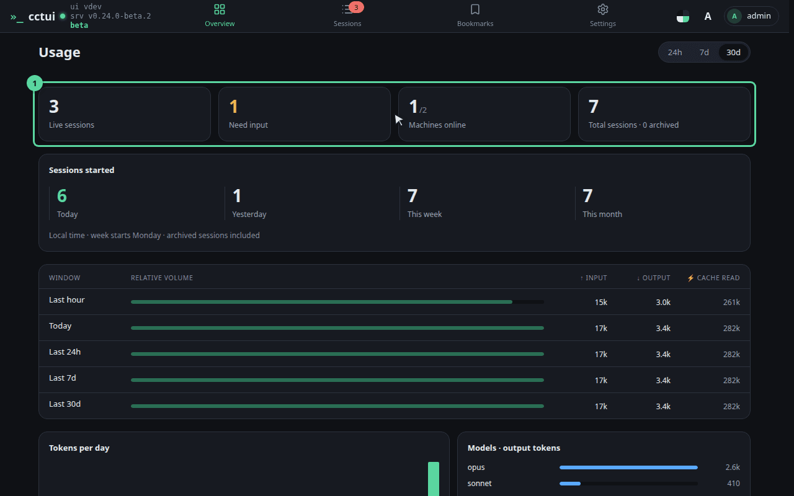
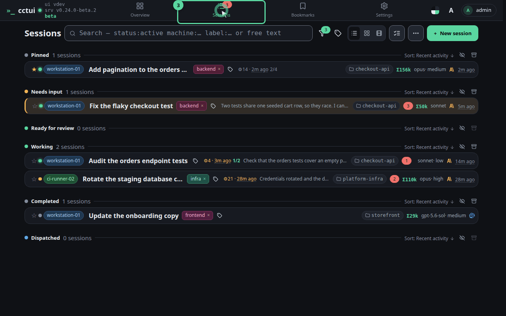
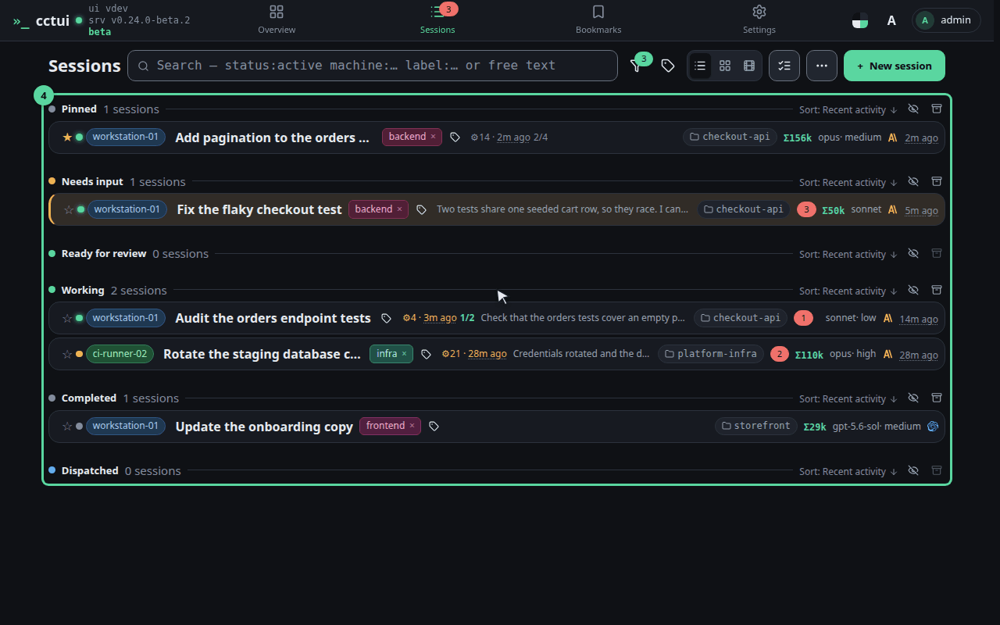
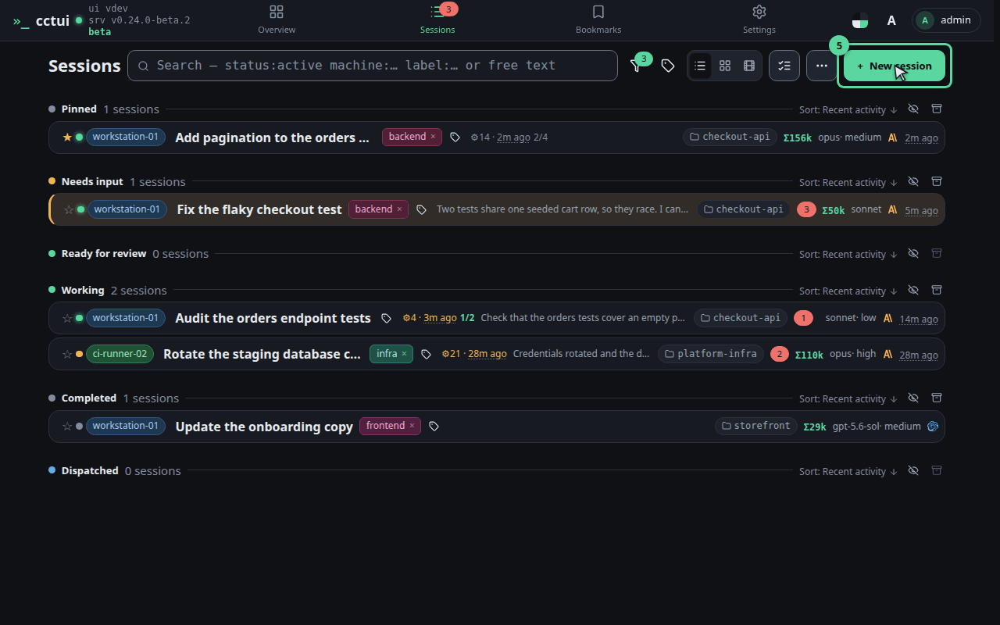
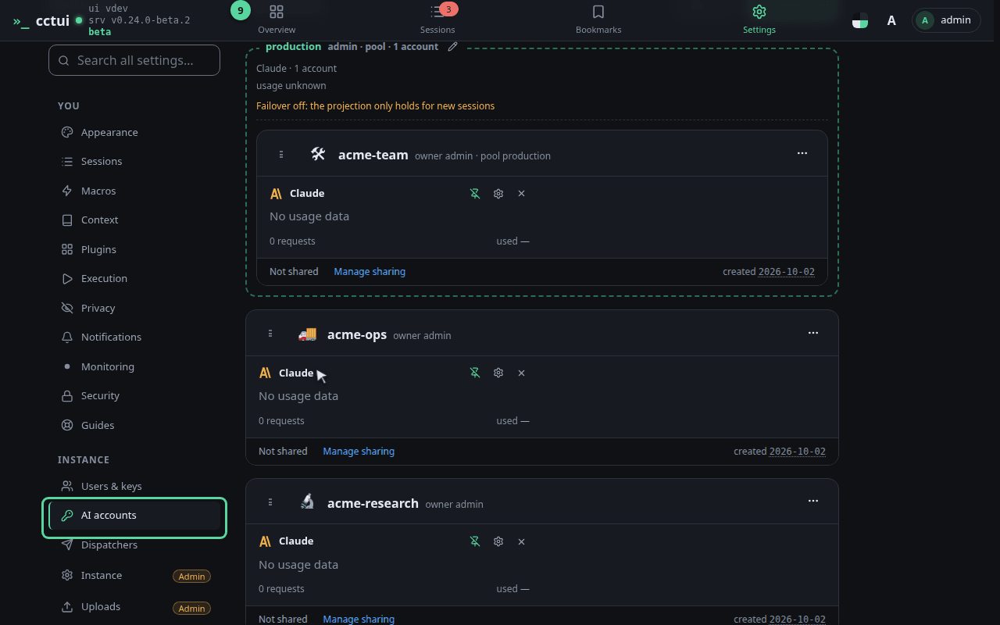
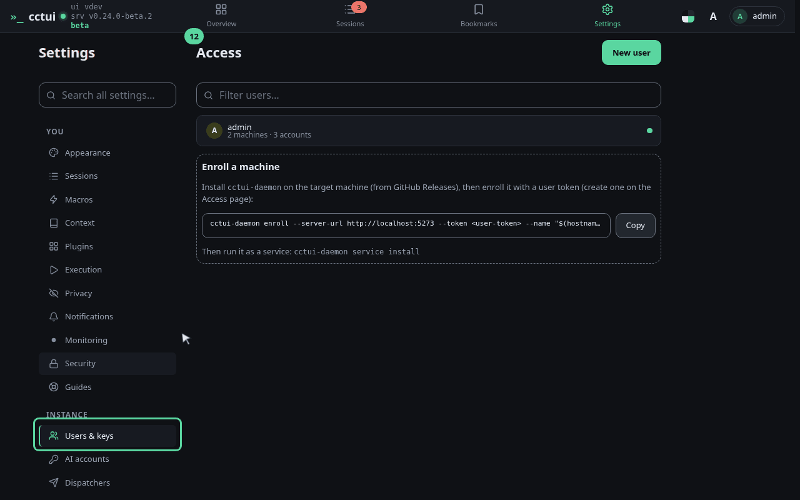
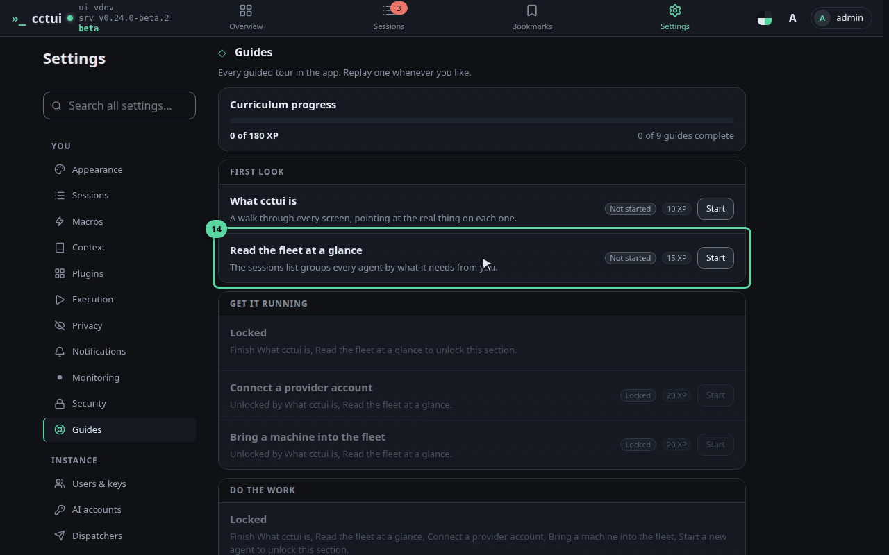

# What cctui is

## viewport=desktop theme=dark

**Start here: is the fleet healthy?**

One control room for every coding agent you run. These tiles answer the first question before you touch anything — what is live, what is stuck, which machines are up.

**The only number that needs you**

An agent waiting on an answer stops making progress until you reply. That is why this count sits on the landing page rather than inside a list you have to go looking for.

**The nav is the whole app**

Every page hangs off this rail. Sessions is where most of the work happens — open it.

**Sessions — where the work happens**

Every run you have started, grouped by what it needs from you. The ones blocked on an answer rise to the top, so a long fleet still reads in one glance.

**Starting one**

This turns a prompt into a running agent: pick the machine, the folder and the account, and it works in the background whether or not you keep the tab open.

**AI accounts — the credentials work runs on**

Provider accounts can be grouped into pools, and a session can draw from a pool rather than one fixed account, so one hitting a rate limit steps aside instead of stalling the queue.

**Users & keys — who may run work**

Machines supply the compute, and they join the fleet from here with a single enrolment command. If a session cannot find anywhere to run, this is the page to open.

**Now walk it for real**

That is every screen. The rest of the guides run inside the app and point at the real controls in order — read the fleet, connect an account, enrol a machine, start a session, follow it. Start with this one.
