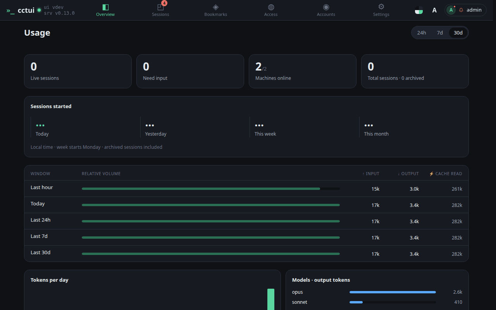
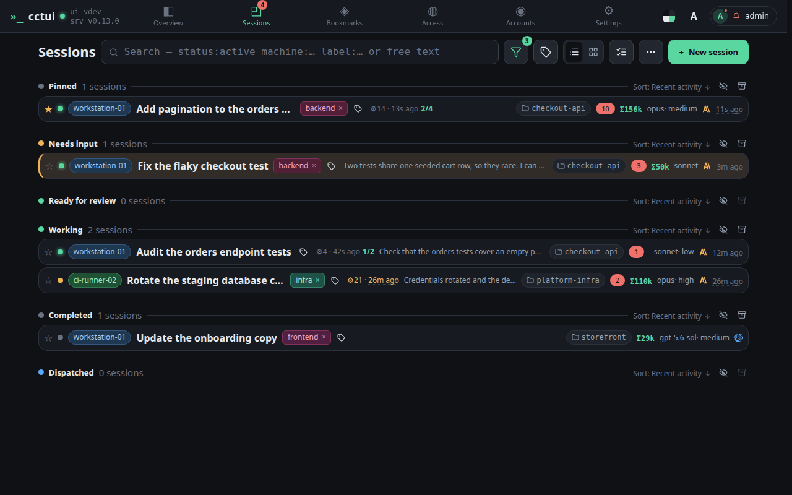
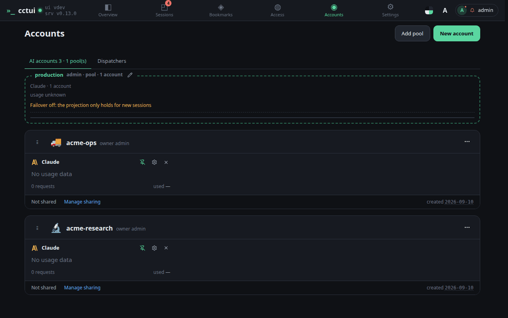
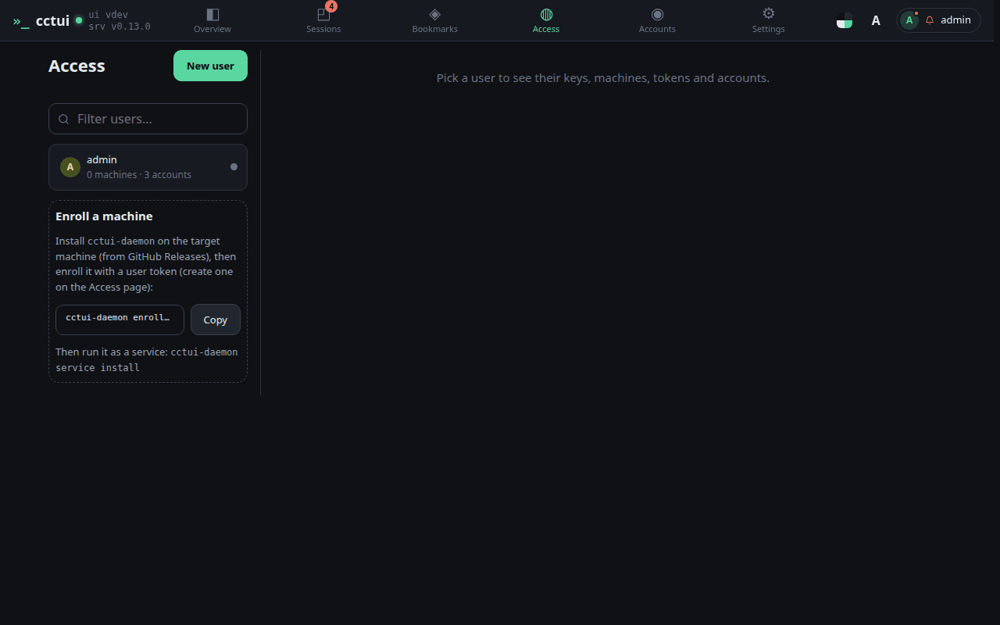
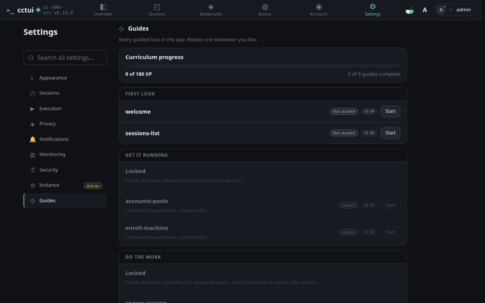
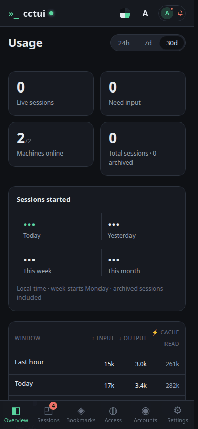
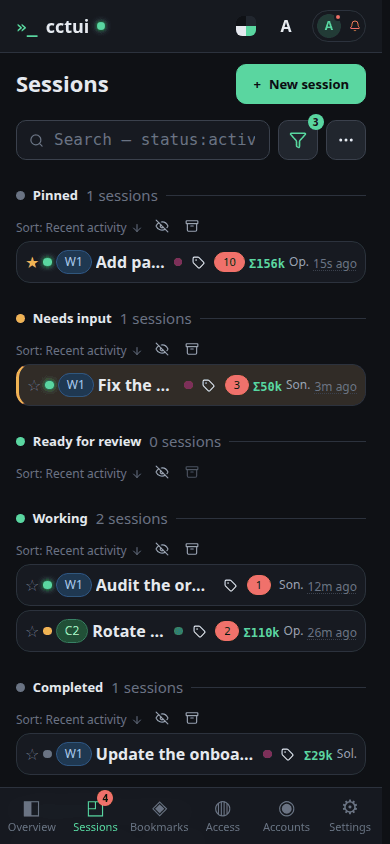
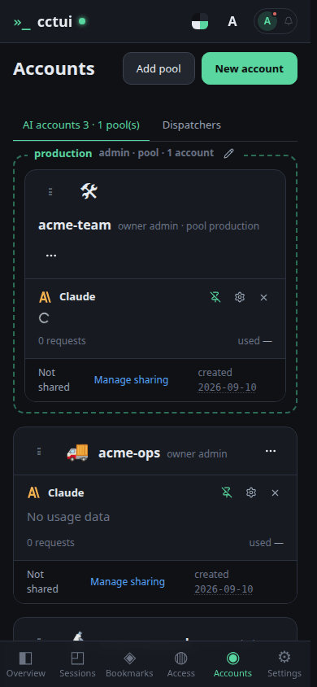
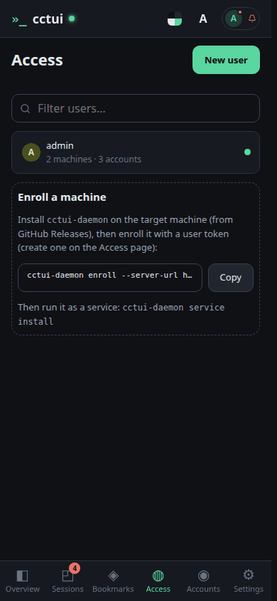
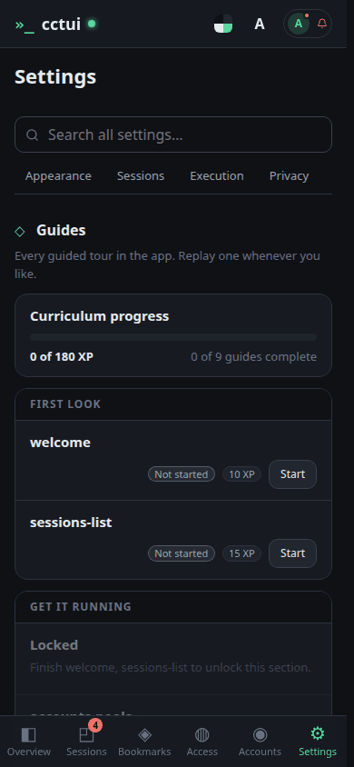

# What cctui is

## viewport=desktop theme=dark

**Start here: is the fleet healthy?**

One control room for every Claude Code session you run. These tiles answer the first question before you touch anything — what is live, what is stuck, which machines are up.

**Sessions — where the work happens**

Every run you have started, grouped by what it needs from you. The ones blocked on an answer rise to the top, so a long fleet still reads in one glance.

**Accounts — where the quota comes from**

Provider accounts are grouped into pools, and a session draws from a pool rather than a fixed account, so one hitting a rate limit steps aside instead of stalling the queue.

**Access — what may run work**

Machines supply the compute, and they join the fleet from here with a single enrolment command. If a session cannot find anywhere to run, this is the page to open.

**Now walk it for real**

That is every screen. The remaining guides run inside the app, pointing at the real controls in order — connect an account, enrol a machine, start a session, follow it. They all live on this page.

## viewport=mobile theme=dark

**Start here: is the fleet healthy?**

One control room for every Claude Code session you run. These tiles answer the first question before you touch anything — what is live, what is stuck, which machines are up.

**Sessions — where the work happens**

Every run you have started, grouped by what it needs from you. The ones blocked on an answer rise to the top, so a long fleet still reads in one glance.

**Accounts — where the quota comes from**

Provider accounts are grouped into pools, and a session draws from a pool rather than a fixed account, so one hitting a rate limit steps aside instead of stalling the queue.

**Access — what may run work**

Machines supply the compute, and they join the fleet from here with a single enrolment command. If a session cannot find anywhere to run, this is the page to open.

**Now walk it for real**

That is every screen. The remaining guides run inside the app, pointing at the real controls in order — connect an account, enrol a machine, start a session, follow it. They all live on this page.
